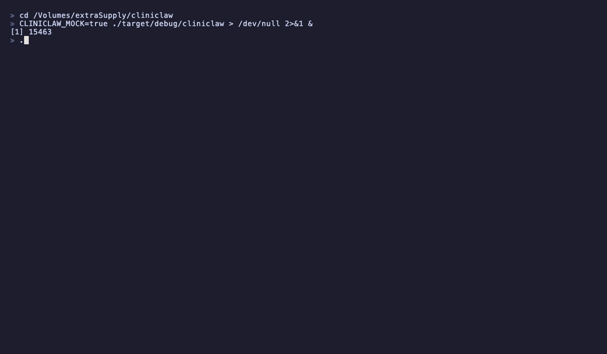

# ClinicClaw

An AI-native, FHIR R4-native Hospital Information System. Every AI agent action is policy-gated, audited, and verifiable.

ClinicClaw is the intelligence layer on top of FHIR — not a FHIR server, not an EHR clone. It solves problems that legacy HIS systems fundamentally cannot: ambient clinical documentation, intelligent order entry, and automated prior authorization, all governed by the VERITAS trust model.

## Demo

### Terminal UI

Real-time agent event streaming with governance pipeline visualization:



**What you're seeing:**
- Press `n` — ambient documentation agent processes a clinical transcript through the full VERITAS governance pipeline (State → Policy → Capability → Execution → Verify → Audit), generates a SOAP note via Claude, writes a FHIR DiagnosticReport
- Press `o` — order entry agent parses "start metformin 500mg BID", runs CDS drug interaction checks, creates a FHIR MedicationRequest
- Press `p` — prior authorization agent assembles clinical justification for bilateral TKR, writes to FHIR
- Chain detection — when ambient doc detects a medication mention, it automatically triggers order entry

### Web UI

A Next.js dashboard with the same SSE stream, confidence scores, turn-based human review, and replay:

```
cd web && npm run dev
```

## Architecture

```
ClinicClaw Agents (ambient docs, order entry, prior auth)
        |
VERITAS Trust Layer (policy engine, audit, verify, capabilities)
        |
FHIR Data Layer (Medplum or any FHIR R4 server)
        |
Claude API (clinical intelligence)
```

Every agent action follows the VERITAS execution model:

```
State -> Policy -> Capability -> Agent -> Verify -> Audit -> FHIR Write
```

## Quick Start

```bash
# Run API server with mock FHIR backend
CLINICLAW_MOCK=true cargo run --bin cliniclaw

# In another terminal — TUI client
cargo run --bin cliniclaw-tui

# Or — web UI
cd web && npm install && npm run dev
```

### TUI Keybindings

| Key | Action |
|-----|--------|
| `n` | Trigger ambient documentation |
| `o` | Trigger order entry |
| `p` | Trigger prior authorization |
| `c` | Clear event stream |
| `q` / `Esc` | Quit |
| `j` / `k` | Scroll down / up |
| `G` / `End` | Jump to bottom |

### CLI Options

```
cliniclaw-tui --api-url http://localhost:3000 --encounter-id enc-001
```

## Crates

| Crate | Purpose |
|-------|---------|
| `cliniclaw-fhir` | FHIR R4 client + resource types |
| `cliniclaw-kernel` | Workspace/turn management, event streaming, audit |
| `cliniclaw-agents` | AI agents (ambient doc, order entry, prior auth) |
| `cliniclaw-policy` | HIPAA/HITECH policy rules, skill-based governance |
| `cliniclaw-persist` | SQLite/Postgres persistence with hash-chain audit |
| `cliniclaw-api` | axum HTTP API server with SSE |
| `cliniclaw-tui` | Terminal UI demo client |

## Stack

- **Language**: Rust (async, tokio)
- **FHIR backend**: Medplum (pluggable — any FHIR R4 server)
- **AI**: Claude API (Anthropic)
- **Storage**: SQLite (dev) / PostgreSQL (prod) via sqlx
- **HTTP**: axum 0.7
- **TUI**: ratatui 0.30
- **Web**: Next.js + shadcn/ui

## Tests

```bash
cargo test --workspace    # 107 tests
```

## License

Apache-2.0
