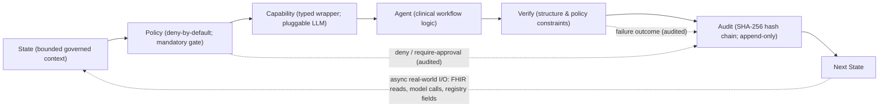
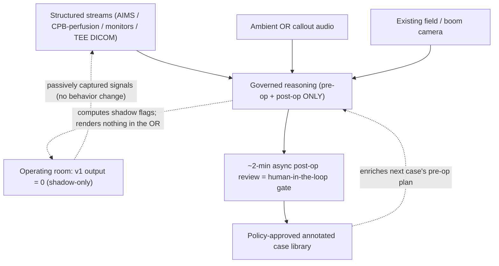
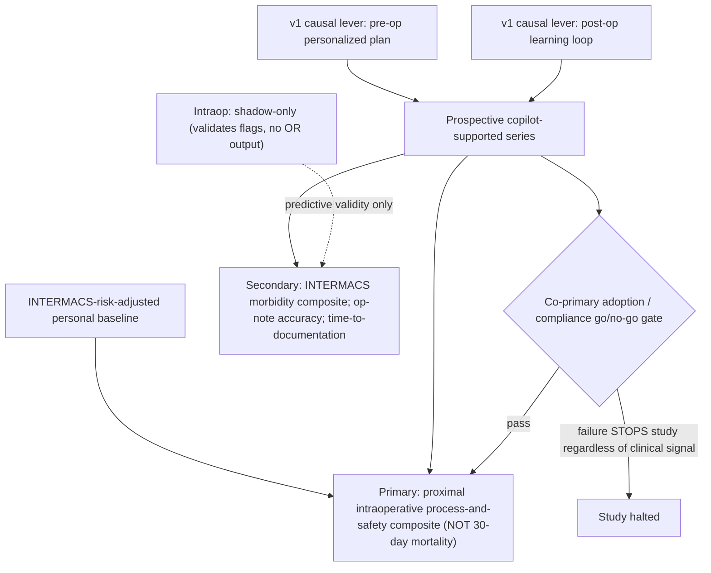
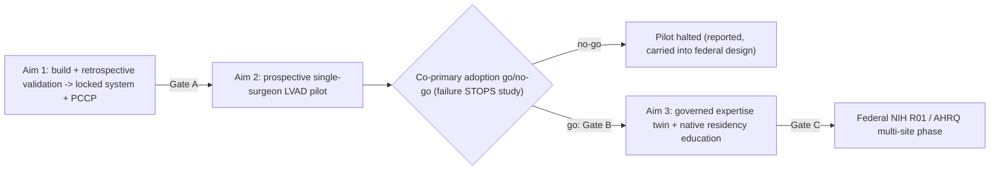

# An AI Surgical Copilot for Mechanical Circulatory Support: A Governed, Non-Interruptive Pilot Toward Personalized Cardiac Surgical Decision Support

> Draft proposal · 2026-05-18 · PI: Eric I. Jeng, MD, MBA (candidate champion surgeon)
> Status: working draft — contains [CONFIRM: …] fields for team verification

## List of Figures

- **Figure 1.** Governed execution spine — the mandatory deny-by-default policy gate and SHA-256 audit chain every copilot action traverses (§5.1.3).
- **Figure 2.** Non-interruptive capture & interaction model — three passive capture channels, a zero-output operating room, and the relocated post-operative human-in-the-loop gate (§5.2).
- **Figure 3.** Aim 2 study design & endpoint logic — comparator, proximal primary composite, secondary endpoints, and the binding co-primary adoption gate (§5.4).
- **Figure 4.** Aims & pilot→federal continuum — the gated progression from build/validation through the prospective pilot to the federal scale-out phase (§5.8).

## 1. Project Summary / Abstract
<!-- source: grounding §1, §2, §7, §13 -->

Durable left ventricular assist device (LVAD) implantation under a mechanical
circulatory support (MCS) program is among the most documentation- and
decision-dense operations in adult cardiac surgery: a long, high-acuity case
on cardiopulmonary bypass with a protocolized sequence of high-consequence
intraoperative decisions, followed by a heavy structured-reporting obligation —
a complete operative note plus the multi-field Society of Thoracic Surgeons
Intermacs (INTERMACS) registry submission. Legacy hospital information systems
and EHRs capture this work only retrospectively, by hand, hours later; they
neither reduce the surgeon's cognitive and clerical load nor make his
accumulated operative experience computationally available at the point of
planning. This is a recognized contributor to cardiac-surgeon burnout, and the
clinician feedback that motivates this work is unambiguous that adoption and
demonstrable policy-compliance — not model accuracy — are the single greatest
determinant of clinical value.

We propose that the durable gap is closed not by a more accurate model but by
a *governed, non-interruptive* copilot in which every suggestion is
deny-by-default policy-gated, provenance-tracked, human-validated, and written
to an immutable SHA-256 audit chain. v1 is deliberately **capture-only,
shadow-mode, with zero output rendered in the operating room**: all clinical
leverage is exerted pre-operatively (a personalized, guideline-concordant plan
retrieved from the surgeon's own governed case library) and post-operatively
(a ~2-minute asynchronous review that relocates the human-in-the-loop gate out
of the OR). The technical approach uses only mature pretrained backbones,
parameter-efficient fine-tuning, and retrieval-grounding — explicitly no
foundation or perception model trained from scratch, which is the wrong choice
for a single-surgeon data regime. The wedge is durable LVAD implantation under
the MCS Program the champion surgeon, Dr. Eric I. Jeng, personally directs,
making the single-surgeon design a deliberate, defensible wedge rather than a
scope limitation. Three aims build and retrospectively validate the governed
pipeline (locked system + Predetermined Change Control Plan), run a
prospective single-surgeon pilot whose primary endpoint is a proximal
intraoperative process-and-safety composite (explicitly not 30-day mortality)
governed by a co-primary adoption go/no-go gate that stops the study if
adoption fails, and build the governed expertise twin evaluated natively
inside the residency he directs. This institutional pilot is deliberately
sized to seed a federal multi-surgeon, multi-site continuation; the enduring
contribution is a reusable, auditable governance pattern for trustworthy
surgical AI that generalizes well beyond this surgeon and this procedure.

## 2. Specific Aims
<!-- source: grounding §7, §9, §14.2, §14.4 -->

Durable left ventricular assist device (LVAD) implantation is among the most
documentation- and decision-dense operations in adult cardiac surgery. The
implanting surgeon must execute and record a protocolized sequence of
high-consequence intraoperative decisions — cannulation strategy, pump-pocket
construction, outflow-graft configuration, right-ventricular management,
de-airing, and weaning from cardiopulmonary bypass — while simultaneously
owning a heavy structured-reporting burden, including a complete operative note
and the multi-field INTERMACS registry submission that gates program quality
review and payer eligibility. Legacy hospital information systems and EHRs
capture this work only retrospectively, by hand, hours later; they neither
reduce the surgeon's cognitive and clerical load nor make his accumulated
operative experience computationally available at the point of planning. This
clerical and cognitive overhead is a recognized driver of cardiac-surgeon
burnout, and no commercially deployed system closes it for a device-implant
workflow. Our thesis is that the durable gap is closed not by a more accurate
model but by a *governed, non-interruptive* copilot — every suggestion
policy-gated, provenance-tracked, human-validated, and audit-chained — validated
first as a disciplined single-surgeon wedge in a Mechanical Circulatory Support
(MCS) Program that the champion surgeon personally directs, and deliberately
structured to seed a federally funded multi-site study.

**Central hypothesis.** A capture-only, shadow-mode governed surgical copilot
can (a) auto-produce accurate operative documentation and INTERMACS registry
fields from passively captured perioperative data, (b) generate personalized,
guideline-concordant pre-operative plans retrieved from the surgeon's own
governed, policy-approved case library, and (c) measurably improve his
INTERMACS-risk-adjusted personal operative-process trajectory across a case
series — with zero operating-room interruption.

The champion surgeon is Eric I. Jeng, MD, MBA, Associate Professor with tenure
in the Division of Cardiovascular Surgery, University of Florida College of
Medicine / UF Health, double board-certified by the American Board of Surgery
and the American Board of Thoracic Surgery, Surgical Director of the MCS
Program, and Program Director of the Integrated Thoracic & Cardiovascular
Surgery Residency. Because he controls case flow, registry participation, the
institutional-pilot path, and the residency in which the educational arm is
evaluated, the single-surgeon design is a deliberate, defensible wedge rather
than a scope limitation. Single-surgeon statistical-power feasibility for the
prospective pilot rests on his durable-LVAD case concentration
[CONFIRM: Dr. Jeng annual isolated durable-LVAD implant volume — owner: Dr. Jeng].

**Aim 1 — Build the governed pipeline and retrospectively validate it.** We
will construct the governed copilot pipeline using only mature pretrained
backbones (surgical-video foundation models and LLMs through ClinicClaw's
existing pluggable LLM layer), parameter-efficient fine-tuning (LoRA, adapters,
instruction-tuning), and retrieval-grounding over the surgeon's governed,
policy-approved LVAD case library; we will explicitly train no foundation or
perception model from scratch, as that is the wrong engineering choice for a
single-surgeon data regime. Perioperative ingestion will draw only from the
three passive capture channels already present in the MCS operating room —
structured AIMS/perfusion/monitor/TEE streams, ambient standardized cardiac
callouts, and the existing field/boom camera — introducing zero new behavior by
any team member. Every computed intraoperative decision-gate assessment is
generated, policy-gated, and audit-chained in **shadow mode only**, with no
output rendered in the operating room. We will validate the locked pipeline
retrospectively on his historical durable-LVAD case library.
*Deliverable:* a locked, version-pinned system plus a Predetermined Change
Control Plan (PCCP) governing all subsequent model updates.

**Aim 2 — Conduct a prospective single-surgeon LVAD pilot.** In a prospective,
single-center, single-surgeon pilot of durable-LVAD implantation, the primary
endpoint is a proximal, high-frequency intraoperative process-and-safety
composite (e.g., cardiopulmonary-bypass time and the rate of detected and
resolved critical-step deviations) measured against his INTERMACS-risk-adjusted
personal baseline — explicitly **not** 30-day mortality, which a single-surgeon
pilot cannot power. Because v1 produces no intraoperative output, copilot
clinical leverage in this aim is exerted **pre-operatively** (the personalized,
guideline-concordant plan from the governed twin) and **post-operatively** (the
closed learning loop across his own case series); the intraoperative layer
remains capture- and shadow-only and serves to validate the predictive accuracy
of its flags for a later phase. A co-primary go/no-go feasibility gate —
copilot acceptance and override-with-justification rates, validated trust scale,
workflow-disruption time, and 100% of suggestions policy-gated and audited —
governs the study: adoption failure stops it regardless of clinical signal.

**Aim 3 — Build the governed expertise twin and evaluate it natively in his
residency.** We will accumulate the policy-approved annotated case library and
construct a governed, retrieval-grounded expertise twin encoding his MCS
technique preferences, personalized thresholds, and decision rules. Educational
value will be evaluated *natively inside the Integrated Thoracic &
Cardiovascular Surgery Residency he directs*, with him as PI/Program Director —
not as a bolt-on study — making the consent/IRB path straightforward and the
education endpoint credible. We will pre-specify explicit go/no-go feasibility
criteria before the twin is claimed to "work," and we will define the federal
multi-surgeon, multi-site scale-out protocol that the pilot's locked endpoints
are designed to seed.

**Closing — impact and the pilot→federal continuum.** This proposal is
deliberately the first stage of a planned continuum: an institutional /
hospital innovation pilot funds Aims 1–2 and the setup of Aim 3 along a fast,
low-risk IRB path, and the resulting preliminary data and *locked* endpoints
are structured to seed an NIH R01 / AHRQ multi-surgeon, multi-site application
that executes Aim 3 at scale — presented as one continuum, not two disconnected
asks. The enduring contribution is not a single LVAD model but a reusable,
auditable governance pattern — policy-gating, provenance, human-in-the-loop,
and an immutable audit chain that doubles as trial data-integrity evidence —
for trustworthy surgical AI that generalizes well beyond this surgeon and this
procedure.

## 3. Significance
<!-- source: grounding §1, §2, §12 -->

### 3.1 The clinical and operational problem is specific to mechanical circulatory support

Durable left ventricular assist device (LVAD) implantation concentrates, in a
single operation, three burdens that compound one another. First, it is a long,
high-acuity case: the patient is, by definition, in advanced heart failure, the
operation is conducted on cardiopulmonary bypass, and the implanting surgeon
carries continuous physiologic responsibility for hours. Second, it is
decision-dense in a way that is unforgiving — cannulation strategy, pump-pocket
construction, outflow-graft configuration and length, intraoperative
right-ventricular assessment and management, methodical de-airing, and weaning
from cardiopulmonary bypass are each high-consequence, time-pressured judgments
with little margin, and several interact (an outflow-graft or de-airing error is
not independently recoverable the way a single anastomotic decision in a bypass
case might be). Third, and distinctively for this workflow, the case is
followed by a heavy *structured* documentation obligation: a complete operative
note plus the multi-field Society of Thoracic Surgeons Intermacs (INTERMACS)
registry submission, which is not optional paperwork — registry participation
gates program quality review and conditions payer eligibility for durable
mechanical circulatory support
[CONFIRM: current INTERMACS registry-participation requirement tied to MCS program quality review / payer coverage — owner: team].

These burdens fall on the same individual and accumulate. The cognitive load of
the operative decisions does not end when the patient leaves the room; it is
followed by hours of after-the-fact structured reconstruction, performed from
memory and scattered source systems, of decisions the surgeon already made once
under pressure. Documentation and clerical overhead of exactly this kind is a
recognized contributor to physician — and specifically cardiac-surgeon —
cognitive load and burnout
[CONFIRM: cardiac-surgeon documentation burden / burnout citation specifics — owner: team] [10].
The first and overriding lesson from the clinician feedback that motivates this
work is that **compliance and workflow adoption are the single greatest
determinant of clinical value**: a system that is not adopted, or that is not
demonstrably policy-compliant, delivers zero clinical value regardless of model
accuracy. Any credible intervention here must therefore reduce — and provably
never add to — that load, and must be evaluated with adoption as a first-class,
gating endpoint rather than as an afterthought.

### 3.2 Why legacy HIS/EHR systems cannot close this gap

The deployed hospital information system and EHR landscape does not fail at this
problem for want of features; it fails because intelligence was never a
first-class citizen of its architecture. These systems capture the LVAD
operation only retrospectively, by hand, hours later. They are systems of
record, not systems of reasoning: they neither lower the surgeon's
in-the-moment cognitive and clerical load nor make his own accumulated operative
experience computationally available at the point where the next plan is
formed. Where AI has been added, it has been added as a bolt-on — an isolated
predictive widget or a documentation macro grafted onto a record system whose
trust, provenance, and audit model was designed for human-entered data, not for
governed machine suggestions. Such bolt-ons cannot satisfy the central clinician
requirement, because the governance that makes an AI suggestion safe to act on —
policy-gating, provenance tracking, human-in-the-loop validation, and an
immutable audit chain — has to be a property of the architecture, not a feature
layered on after the fact. The durable gap is therefore not a missing model; it
is the absence of a system in which every AI suggestion is governed by design.

### 3.3 State of the art, honestly framed

The proposal deliberately does not rest on speculative technology. Three
literatures, read honestly, define both the opportunity and the real risk.

**The perception bedrock is mature, not speculative.** Systematic reviews of
surgical video AI report phase-recognition accuracy in the range of roughly
81–93% across procedures, and instrument and anatomy identification are
similarly established as actively developed, well-characterized capabilities
[6][7]. We do not need to advance — and explicitly will not train from scratch —
the perception layer; mature pretrained backbones, consumed through ClinicClaw's
existing pluggable model layer and adapted by parameter-efficient fine-tuning,
are the correct and lowest-risk engineering choice for a single-surgeon data
regime. We also note honestly that open cardiac surgery is not laparoscopy: the
reported figures come largely from endoscopic procedures, which is precisely why
our capture model is multimodal and structured-stream-anchored rather than
scope-only.

**Funding momentum for surgical digital twins is real.** Personalized
surgical digital twins are an actively funded, peer-reviewed direction
[4][5], establishing both reviewer appetite and a useful distinction: most of
that work targets a *patient* digital twin (a simulable physiologic model of an
individual patient), whereas the contribution here is a governed *expertise*
twin — a retrieval-grounded, policy-bound representation of one surgeon's
documented practice. This distinction is a strength: it sidesteps the heaviest
modeling claims while addressing the surgeon's explicitly stated wish for a
governed representation of his own practice.

**Diagnostic accuracy is not patient benefit, and self-updating models break
locked trials.** The same literature is candid about why accurate models fail
to become clinical value. Scoping reviews of randomized evaluations of AI in
clinical practice show that demonstrated diagnostic or predictive accuracy does
not translate into demonstrated patient or process benefit, and that workflow
integration and adoption are where most clinical AI fails [8]. Separately, FDA
guidance on AI-enabled devices and the Predetermined Change Control Plan
framework make explicit that models which update themselves after a trial
invalidate that trial's locked endpoints unless the change is governed by a
pre-specified plan [9]. Taken together, these two findings are not obstacles to
work around — they are the design constraints that *justify* this proposal's
shape: a process-and-adoption endpoint structure rather than a hard-outcome
overclaim, a hard adoption go/no-go feasibility gate, and a Predetermined
Change Control Plan with an immutable audit chain that doubles as trial
data-integrity evidence.

### 3.4 The specific gap this proposal fills

What does not yet exist — and what this proposal delivers — is a *governed,
auditable, non-interruptive* surgical copilot for a high-burden device-implant
workflow, validated in the one setting where validation is actually tractable: a
program the champion surgeon personally directs. Anyone can run an
80–90%-accurate video model; almost no one has a copilot in which every
suggestion is policy-gated, provenance-tracked, human-validated, and
audit-chained, and in which the system is *constrained by design to never
interrupt the operating room*. That governed, adoption-instrumented,
zero-interruption design — not the underlying model accuracy — is the moat, and
it maps directly onto the clinicians' first-order concern.

The single-surgeon, single-program scope is the wedge, by design, not a
limitation conceded. Validating in the Mechanical Circulatory Support Program
that Dr. Jeng directs makes the "champion surgeon" condition airtight: he
controls case flow, registry participation, the institutional-pilot path, and
the residency in which the educational arm is evaluated. The wedge logic is
explicit and disciplined — win one procedure with one surgeon under conditions
that produce *locked* endpoints and clean preliminary data, then scale that
governed pattern to a federally funded multi-surgeon, multi-site study.
Generalizability is intentionally deferred to that federal phase, not ignored;
the enduring contribution is the reusable governance pattern itself, which
generalizes well beyond this surgeon and this procedure.

## 4. Innovation
<!-- source: grounding §3, §5, §15.1 -->

### 4.1 The primary innovation is the governance layer, not the model

We state the contribution plainly so the study section is not left to infer
it. Commodity surgical-video models that recognize operative phases, instruments,
and anatomy at roughly 81–93% accuracy are *not* the innovation in this proposal
[6][7]. That perception capability is mature, widely reproduced, and consumed
here off the shelf; treating it as the scientific contribution would be both
inaccurate and the wrong place to spend reviewer trust. The innovation is the
trust and governance layer that sits between any such model and the surgeon —
VERITAS — in which **every** AI suggestion is policy-gated before it is allowed
to surface, provenance-tracked to the exact governed source it was derived from,
human-in-the-loop validated before it is treated as truth, and written into an
immutable SHA-256 audit chain. Section 3 established *why* this is the durable
gap: governance that makes a machine suggestion safe to act on must be a
property of the architecture, not a widget bolted onto a record system designed
for human-entered data. The innovation claimed here is the concrete realization
of that property for a high-burden cardiac device-implant workflow — a copilot
in which no suggestion can reach a clinician, enter the operative note, or
populate an INTERMACS field without first passing a deny-by-default policy gate
and being recorded with verifiable provenance. The same audit chain that
enforces clinical governance simultaneously functions as tamper-evident trial
data-integrity evidence and as the substrate of a Predetermined Change Control
Plan, so one architectural mechanism discharges three obligations — clinical
safety, research integrity, and regulatory change control — that are normally
solved by three disconnected systems, or not solved at all.

### 4.2 Decoupling capture from feedback as a design innovation

The second innovation is a design decision rather than a component: the
deliberate decoupling of the *capture* channel from the *feedback* channel.
Surgical-AI efforts characteristically die not in the model but in adoption,
because they push real-time output at the operating surgeon — the output channel
is the hard, device-regulated, attention-competing, sterility-constrained part,
whereas passive capture is none of those things. v1 is therefore engineered to
be **capture-only, ambient, and shadow-mode, with zero output rendered in the
operating room.** All copilot reasoning is relocated to pre-operative planning
and asynchronous post-operative review, outside the sterile field and off the
intraoperative critical path; every intraoperative decision-gate assessment is
still computed, policy-gated, and audit-chained, but it is logged for later
validation, never surfaced. This is a genuine innovation because it dissolves
the single most common adoption-killer by construction rather than by
mitigation: the system cannot interrupt the operating room because it has no
mechanism to do so. It also yields a clean scientific posture — the
intraoperative layer becomes a prospectively validatable predictor whose flags
can be scored for accuracy *before* any future phase earns the right to surface
them.

### 4.3 Mature backbones, parameter-efficient adaptation, and governed retrieval

The personalization strategy is itself a deliberate, self-justifying engineering
choice rather than a default. We compose three mature, low-risk elements:
pretrained surgical-video and language backbones consumed through ClinicClaw's
existing pluggable model layer; parameter-efficient fine-tuning (LoRA, adapters,
instruction-tuning) of those backbones on the surgeon's governed,
policy-approved case library; and retrieval-grounding over that same governed
library for case-specific reasoning. We will train **no foundation or perception
model from scratch** — explicitly a non-goal, restated here because reviewers
should not have to wonder. The justification is a data-regime argument, not a
preference: a single surgeon's durable-LVAD history is, by orders of magnitude,
the *correct* scale for parameter-efficient adaptation and retrieval and the
*wrong* scale for from-scratch training, which would demand population-scale
corpora the wedge intentionally does not have and would forfeit the
generalization already captured in the pretrained backbones. The innovation is
not the existence of these techniques but their disciplined composition under
governance — adaptation and retrieval that draw *only* from policy-approved,
human-validated, provenance-tagged cases, so the personalized behavior of the
system is auditable back to the specific documented practice that produced it.

### 4.4 The governed expertise twin as a novel construct

These elements compose into a construct we believe is genuinely new: a
*governed expertise twin*. It is a retrieval-grounded, PEFT-adapted,
policy-bound representation of one surgeon's *documented* practice — his
annotated case library, technique preferences, personalized thresholds, and
decision rules — surfaced through a mature reasoning engine under VERITAS policy
and audit. Three properties make it novel rather than a relabeled fine-tuned
model. First, it is grounded in documented, policy-approved practice and is
auditable back to that evidence, not a black-box weight set; what it "knows" is
traceable to specific human-validated cases. Second, it "learns" only by
accumulating the surgeon's policy-approved annotated cases — the
annotation-and-learning capability clinicians explicitly valued — so its growth
is itself a governed, human-in-the-loop process. Third, it is explicitly **not
a cloned model of the surgeon's hands**, not autonomous, and not a substitute
for surgical judgment; it is a representation of what he has documented, not a
simulator of what he does. Because the claim "the twin works" is exactly the
kind of soft assertion study sections distrust, the construct is bounded by
pre-specified, explicit feasibility gates: it is not claimed to work until it
demonstrably meets concordance and validation criteria defined in advance (Aim
3), and the prospective pilot is independently governed by a hard
adoption/compliance go/no-go gate that stops the study regardless of any
twin-related signal.

### 4.5 What this is not: patient digital twins and ungoverned scribe/CDS products

The construct is deliberately distinct from the two adjacent categories with
which a reviewer might conflate it. It is **not a patient digital twin.** The
actively funded, peer-reviewed digital-twin literature largely targets a
simulable physiologic model of an *individual patient* used to rehearse or
predict that patient's course [4][5]; our twin models a *surgeon's documented
practice*, not a patient's physiology, which deliberately sidesteps the heaviest
biophysical-modeling claims while still answering the champion surgeon's stated
wish for a governed representation of his own practice. It is equally **not an
ungoverned scribe or clinical-decision-support product.** Commercial ambient
scribes and CDS widgets generate documentation or alerts, but their suggestions
are not deny-by-default policy-gated, not provenance-tracked to a specific
governed source, not validated through a human-in-the-loop gate that is itself
audited, and not written to an immutable chain that doubles as trial-integrity
evidence — precisely the governance properties Section 3 identified as the
durable gap, and precisely why an accurate model on its own does not become
clinical value [8]. The differentiator is therefore not capability but
governance: the same underlying suggestion is, in this system, gated, attributed,
human-validated, and permanently auditable, and that is what makes it safe to
adopt.

## 5. Approach
### 5.1 Conceptual framework & wedge
<!-- source: grounding §2, §14.2 -->

#### 5.1.1 The wedge: isolated durable LVAD implantation

The pilot is scoped, deliberately and narrowly, to a single procedure
performed by a single champion surgeon at a single center: **isolated, durable
left ventricular assist device (LVAD) implantation, conducted within the
Mechanical Circulatory Support (MCS) Program that Dr. Jeng directs as Surgical
Director.** This is the entire intervention surface of the pilot; everything
else in the proposal is built to validate this one wedge and to structure the
preliminary data it produces for a later federal phase. The wedge is justified
on three concrete grounds.

**Case volume under a program the surgeon controls.** A single-surgeon
prospective pilot is only statistically feasible if one surgeon performs enough
of the index operation to power a proximal, high-frequency endpoint. Because
Dr. Jeng is Surgical Director of the MCS Program, durable-LVAD case flow,
registry participation, trainee involvement, and the institutional-pilot path
are all under his direct control rather than dependent on referral or
multi-surgeon coordination — which is precisely what makes the "champion
surgeon" condition airtight rather than aspirational. The pilot's power
calculation rests on his annual isolated durable-LVAD implant concentration
[CONFIRM: Dr. Jeng annual isolated durable-LVAD implant volume — owner: Dr.
Jeng]; the named fallback below exists specifically to absorb the case in which
that volume is insufficient
[CONFIRM: annual durable-LVAD vs bicuspid-aortic case volumes — owner: Dr.
Jeng].

**INTERMACS risk-adjusted outcomes.** Durable LVAD implantation is covered by
the Society of Thoracic Surgeons Intermacs (INTERMACS) registry [11], which
already captures risk-adjusted outcomes for these cases. INTERMACS therefore
plays for the LVAD wedge the role the STS Adult Cardiac Surgery Database [12]
plays for general cardiac surgery: it makes a risk-adjusted *personal* comparator
tractable without standing up a bespoke registry, and it is arguably tighter
for a protocolized device-implant procedure than for a more heterogeneous
operation. Endpoint mechanics built on this comparator are detailed in §5.4
and §5.6; here it suffices that the wedge was chosen partly *because* a
free, risk-adjusted outcome substrate already exists for it.

**A protocolized sequence of critical steps.** Durable LVAD implantation
decomposes into a well-defined, ordered set of high-consequence intraoperative
decision points — cannulation strategy, pump-pocket construction,
outflow-graft configuration, intraoperative right-ventricular assessment and
management, methodical de-airing, and weaning from cardiopulmonary bypass.
Each is a discrete, recognizable decision gate with a defined correct-execution
envelope, several of them tightly coupled (an outflow-graft or de-airing error
is not independently recoverable the way an isolated anastomotic choice can
be). This protocolization is what makes the procedure a tractable target for
structured critical-step capture, shadow-mode decision-gate assessment, and
deviation flagging: the copilot is reasoning over a constrained, named state
space, not an open-ended one.

#### 5.1.2 CABG demotion and the named fallback wedge

Isolated on-pump coronary artery bypass grafting (CABG) was the
procedure-agnostic default in the underlying study design and is retained
**only as a federal-phase generalization target**, not as the pilot wedge:
generic CABG does not sit where Dr. Jeng's program leadership or case
concentration sits, and using it would forfeit the airtight champion-surgeon
condition that the MCS Program provides. The pilot wedge is the LVAD procedure
defined in §5.1.1; CABG re-enters the program only in the multi-surgeon,
multi-site federal phase, as one of the procedures to which the *governance
pattern* is generalized, not as anything this single-surgeon pilot attempts to
power.

If the durable-LVAD annual volume proves insufficient to power the prospective
pilot, the **named fallback wedge is bicuspid aortic valve / aortic root
surgery**, performed within the Bicuspid Aortic Valve Program and Aortic
Disease Center that Dr. Jeng also directs and tracked through the STS Adult
Cardiac Surgery Database. The fallback preserves every structural property the
proposal depends on — a single champion surgeon who controls case flow under a
program he directs, a free risk-adjusted outcome substrate, and a protocolized
critical-step structure — and changes only the index procedure and the
registry (STS in place of INTERMACS). The volume comparison that decides
between primary and fallback wedge is the open confirmation item recorded
above.

#### 5.1.3 The ClinicClaw / VERITAS execution spine

Every copilot action in this proposal runs on a single, fixed execution
sequence inherited from the VERITAS trust model and implemented in the
ClinicClaw runtime:

**State → Policy → Capability → Agent → Verify → Audit → next State.**

The sequence is not a diagram for reviewers; it is the literal control flow
each suggestion traverses, adapted from the synchronous VERITAS reference
implementation for the asynchronous, real-world I/O this setting requires
(FHIR record reads, model inference calls, registry-field generation):

- **State** — the governed context for a step: the relevant FHIR resources,
  the surgeon's policy-approved case library, and the structured perioperative
  capture for the case. No copilot logic reads anything outside this bounded
  state.
- **Policy** — before any model is invoked, the proposed action is evaluated
  against an explicit policy. The engine is **deny-by-default**: an action is
  blocked unless a policy affirmatively permits it, and policies can return
  permit, deny, or require-human-approval. There is no path by which a
  suggestion reaches a clinician, enters the operative note, or populates an
  INTERMACS field without first clearing this gate.
- **Capability** — the permitted action is executed only through a typed
  capability wrapper. Model inference in particular is never called directly
  from agent logic; it is mediated by the pluggable LLM capability (Claude,
  local, or deterministic mock), which also records confidence, latency, and
  token-usage metadata for governance.
- **Agent** — the clinical workflow logic (pre-operative planning,
  documentation drafting, shadow-mode decision-gate assessment) runs only on
  state the policy gate has already cleared and only through capabilities.
- **Verify** — the agent's output is checked against expected structure and
  policy constraints before it is allowed to become a result; failure routes
  to a typed failure outcome, not to a silent pass.
- **Audit** — every step, including denials, errors, verification failures,
  and approvals-pending, is written to an append-only, SHA-256 hash-chained
  audit record. The chain is tamper-evident by construction and is reused
  directly as trial data-integrity evidence and as the substrate of the
  Predetermined Change Control Plan (§6).

Two properties of this spine are load-bearing for the rest of the Approach.
First, the policy gate is mandatory and deny-by-default, so "every AI
suggestion is policy-gated and audited" is an architectural invariant the
pilot can instrument and report at 100%, not an aspiration. Second, because
the spine is procedure-agnostic, the same governed execution path serves the
LVAD wedge, the bicuspid-aortic fallback, and the federal-phase generalization
targets unchanged — the wedge selects the clinical content, while the
governance pattern that is the proposal's enduring contribution stays fixed.
This fixed, mandatory control flow is shown in Figure 1.

**Figure 1.** Governed execution spine: every copilot action traverses a mandatory, deny-by-default policy gate and is written to an append-only SHA-256 hash-chained audit record before the next state — adapted from the synchronous VERITAS reference model for the asynchronous, real-world I/O this setting requires.

### 5.2 Non-interruptive capture & interaction model
<!-- source: grounding §15 -->

This subsection is the proposal's central design differentiator and the direct
answer to the clinicians' first-order concern. It states, as a binding
constraint rather than an aspiration, exactly how the copilot is prevented from
ever interrupting the operating room — and why that constraint, far from
weakening the pilot, is what makes it adoptable, IRB-tractable, and
scientifically clean. Figure 2 makes the model concrete: capture is pervasive
and passive, the operating room is a strictly zero-output node, and the only
human interaction is an asynchronous post-operative gate outside the OR.

**Figure 2.** Non-interruptive capture & interaction model: three pre-existing passive capture channels feed governed reasoning that runs pre-operatively and post-operatively only; the operating room is, by construction, a zero-output (shadow-only) node, and the relocated human-in-the-loop gate is a short asynchronous post-operative review producing the policy-approved annotated case library.

#### 5.2.1 Core principle: decouple capture from feedback

Surgical-AI systems do not characteristically fail because their models are
inaccurate; they fail in adoption, and they fail there because they push
real-time *output* at the operating surgeon. The output channel — a
heads-up display, an audible alert, an in-field prompt — is the hard part:
it is device-regulated, attention-competing, sterility-constrained, and
distraction-inducing at exactly the moments of highest consequence. The
*capture* channel is none of those things. The foundational design decision of
this proposal is therefore to **decouple capture from feedback** and to
deliver only the half that is safe and cheap in v1.

Concretely, **v1 is capture-only, ambient, and shadow-mode, with zero output
rendered in the operating room.** Every intraoperative decision-gate
assessment the system can compute — what it *would* flag at cannulation, at
pump-pocket construction, at outflow-graft configuration, at de-airing, at
right-ventricular assessment, at weaning from cardiopulmonary bypass — is still
computed, still policy-gated through the deny-by-default VERITAS spine of
§5.1.3, and still written to the SHA-256 audit chain with timestamps. It is
simply never surfaced. All copilot clinical reasoning that the surgeon
actually consumes runs **pre-operatively** (the personalized,
guideline-concordant plan, §5.5) and **post-operatively** (the asynchronous
review described in §5.2.3 and the closed learning loop), entirely outside the
sterile field and entirely off the intraoperative critical path.

The strength of this framing is that it resolves the adoption-killer **by
construction, not by mitigation**: the system cannot interrupt the operating
room because, in v1, it has no mechanism by which to do so. There is no
display to glance at, no alert to suppress, no prompt to dismiss. The most
common reason surgical-AI pilots are abandoned is engineered out of existence
rather than managed down, and the residual adoption question becomes the much
softer one of whether a ~2-minute asynchronous post-operative task is
acceptable — a question §5.2.3 answers and §5.4 measures with a hard go/no-go
gate.

#### 5.2.2 Three passive capture channels — all already present in the MCS OR

The durable-LVAD operating room is, for the purposes of this proposal,
fortuitously over-instrumented: a modern mechanical-circulatory-support case is
already one of the most densely monitored environments in surgery. v1
therefore introduces **zero new behavior by any member of the operative team
and no new device into the sterile field.** It draws only on three capture
channels that already exist in that room for clinical reasons unrelated to this
study.

1. **Structured perioperative streams (the backbone).** The anesthesia
   information management system (AIMS) / anesthesia record, the
   cardiopulmonary-bypass / perfusion machine logs (pump flows, activated
   clotting time, aortic cross-clamp on/off, bypass on/off), the physiologic
   monitor data, and the intraoperative transesophageal-echocardiography (TEE)
   DICOM loops are all generated and timestamped as a matter of routine LVAD
   practice. They are FHIR/HL7-mappable and require no action by anyone — the
   perfusionist, anesthesiologist, and echocardiographer are already producing
   this data for the case itself. For a protocolized device-implant procedure
   these structured streams are unusually informative: bypass and clamp
   on/off events and perfusion parameters are precisely the timestamps that
   anchor the critical-step timeline the copilot reasons over, and the TEE
   loops are the substrate for de-airing and right-ventricular assessment.
   This channel is the backbone of capture; the next two enrich it.

2. **Ambient OR audio of standardized cardiac callouts.** Cardiac surgery is
   conducted with a highly standardized verbal choreography — "going on
   bypass," "cross-clamp on," "coming off pump," "de-airing" — that is
   structured *by convention* and spoken aloud as routine team communication
   regardless of whether anything is recording. v1 captures this with a single
   room microphone and zero workflow change: no one is asked to speak
   differently, address the system, or alter the existing callout discipline.
   The callouts are used only to corroborate and time-align the structured
   streams, not to elicit new speech.

3. **The existing field / boom camera.** Most cardiac operating rooms,
   including those used for mechanical circulatory support, already carry a
   field or boom-mounted camera over the operative field. v1 does not add a
   camera, and explicitly does **not** add any device to the sterile field;
   it consumes the feed of equipment that is already in the room. Enabling its
   recording for research is governed entirely as a consent and IRB matter
   (§5.2.4) — it is a data-governance question, not a change in how anyone
   operates.

The unifying property across all three channels is the one the surgeon
demanded: **no team member does anything new.** The perfusionist runs the
pump as always; the anesthesiologist charts as always; the surgeon and team
call out as always; the camera that is already there is, with consent,
recorded. Capture is pervasive precisely because it is parasitic on
instrumentation and behavior that already exist for the operation itself.

#### 5.2.3 The single human interaction: a ~2-minute asynchronous post-op review

The copilot's *entire* required human interaction with the surgeon, beyond
his ordinary pre-operative plan review, is a single asynchronous task: a
roughly two-minute, tablet-based post-operative review, performed at the
surgeon's convenience after the case and outside the operating room. In it,
the surgeon confirms or annotates (a) the auto-drafted operative note and
INTERMACS registry fields generated from the passively captured perioperative
data, and (b) the shadow-flagged intraoperative deviations the system computed
but never surfaced during the case.

This step does double duty and is the design's pivotal move. It is, on the
clinical side, a deliberately minimal documentation-validation task that
*reduces* the surgeon's existing after-the-fact reconstruction burden rather
than adding to it. More importantly, on the governance side, it **relocates
the VERITAS human-in-the-loop approval gate out of the operating room
entirely** while still discharging it: the surgeon's confirmation/annotation is
the policy-required human approval, captured asynchronously, and it yields
exactly what the governed expertise twin needs — policy-approved,
human-validated, provenance-tagged labels — without any in-OR interaction. The
human-in-the-loop gate that §5.1.3 and §5.5/§5.6 require is therefore *moved*
from intra-operative to post-operative; it is not weakened, removed, or made
optional. Every shadow-flagged deviation the surgeon adjudicates in this review
becomes a validated label that both measures the predictive accuracy of the
intraoperative layer (the scientific posture of §5.4) and enriches the governed
case library (Aim 3, §5.5).

#### 5.2.4 What v1 explicitly does NOT do

To leave the study section no room to infer a real-time capability that does
not exist, v1 is defined as much by exclusion as by inclusion. In v1 there is:

- **No heads-up display (HUD)** and no in-field visual output of any kind.
- **No real-time intraoperative prompt, alert, or audio cue** to the surgeon
  or to any team member.
- **No new device introduced into the sterile field**, and no new device of
  any kind that the team must wear, hold, mount, or attend to.
- **No behavior change** required of the surgeon, perfusionist,
  anesthesiologist, echocardiographer, nurse, or any other team member —
  capture is parasitic on existing instrumentation and existing standardized
  communication.

Any reading of this proposal that attributes an intraoperative output to v1 is
incorrect: the v1 intraoperative footprint is exactly zero, by construction.

#### 5.2.5 Staged egocentric capture and endpoint reconciliation (cross-references)

Two consequences of this model are developed elsewhere and are noted here only
so the design is complete and internally consistent.

First, **egocentric ("smart-glass") capture is intentionally deferred to a
later phase, not part of v1.** First-person capture mounted on the surgeon's
existing loupes/headlight gear is the richest possible data source for an
individual-surgeon twin, but it carries additive scope — integration with
existing loupes and coaxial headlight, sterility/infection-control review,
OR-committee approval, multi-hour battery, and first-person consent — and any
heads-up *display* on such gear is itself precisely the in-OR interruption this
section rules out. It is therefore staged: a passive egocentric *recorder with
no display* in Phase 2, and real-time heads-up feedback only in a later phase
that carries its own human-factors and device-classification study. The full
staging roadmap is given in §8.

Second, a strictly zero-interruption v1 performs no intraoperative action and
therefore cannot, on its own, causally move an *intraoperative* metric; pure
shadow mode proves only documentation/registry accuracy and the predictive
validity of its shadow flags. The reconciliation — that v1's clinical leverage
is exerted pre-operatively and post-operatively while the intraoperative layer
remains capture/shadow-only and merely *validates* flags for a later minimally
vetted-feedback phase, preserving both the §5.4 clinical/OR primary endpoint
and absolute zero OR disruption — is set out in full in §5.4 (Aim 2) and §5.6
(rigor, statistics & data), including the explicit fallback if reviewers demand
an in-OR intervention.

The recording governance underlying §5.2.2 (channels 2 and 3) and §5.2.4 is an
open institutional confirmation:
[CONFIRM: OR ambient-audio + camera capture/recording governance + consent
path at UF — owner: Dr. Jeng / IRB].

### 5.3 Aim 1 — Build & retrospective validation
<!-- source: grounding §3, §4, §7 Aim 1, §15.2 -->

Aim 1 constructs the governed copilot pipeline and validates it
*retrospectively, before any prospective case is touched*. The aim produces no
intraoperative output and changes no clinical behavior; its entire footprint is
a build phase followed by an offline measurement against the surgeon's own
historical record. Its deliverable is an artifact deliberately frozen for Aim
2: a locked, version-pinned system plus a Predetermined Change Control Plan
(PCCP).

#### 5.3.1 Pipeline build

The pipeline is assembled, not invented. Every stage either consumes a mature
pretrained component off the shelf or runs on the fixed VERITAS execution spine
of §5.1.3; nothing in Aim 1 trains a model of perception or language from
scratch. The build proceeds in five composed stages.

**Stage 1 — Ingestion of the three passive capture channels.** Ingestion draws
*only* on the three passive channels defined and bounded in §5.2.2 — the
structured perioperative streams (AIMS/anesthesia record, CPB/perfusion logs,
physiologic monitor data, intraoperative TEE DICOM), the ambient OR audio of
standardized cardiac callouts, and the existing field/boom camera feed. We do
not re-derive that channel inventory or its zero-new-behavior property here; §5.2
governs it. Aim 1's build task is the engineering of the ingestion path itself:
time-base alignment of the heterogeneous streams to the structured-stream
backbone (the CPB/clamp/bypass on-off events and perfusion timestamps that §5.2.2
identifies as the most informative anchors), FHIR/HL7 mapping of the structured
streams, and normalization of the audio and video feeds into time-aligned,
provenance-tagged inputs. Each ingested artifact enters the pipeline only as
governed **State** in the §5.1.3 sense — bounded, attributed to its source
channel and timestamp, and readable by no downstream stage except through the
policy gate.

**Stage 2 — Structured critical-step timeline via off-the-shelf models.** From
the aligned multimodal capture, the pipeline derives a structured timeline over
the protocolized critical steps named in §5.1.1 — cannulation, pump-pocket
construction, outflow-graft configuration, intraoperative right-ventricular
assessment, methodical de-airing, and weaning from cardiopulmonary bypass. Step
recognition uses mature pretrained surgical-video and event-detection backbones
consumed through ClinicClaw's existing pluggable model layer, corroborated by
the structured-stream events (bypass/clamp on-off, perfusion parameters) and the
time-aligned callouts. The timeline is the constrained, named state space the
rest of the pipeline reasons over; it is produced by composition of existing
capabilities, consistent with the data-regime rationale in §5.3.3.

**Stage 3 — Parameter-efficient fine-tuning and retrieval personalization on the
governed historical case library.** Personalization is applied to the mature
language/reasoning backbone by parameter-efficient fine-tuning (LoRA, adapters,
instruction-tuning) together with retrieval-grounding, drawing *exclusively* on
Dr. Jeng's historical, policy-approved, provenance-tagged durable-LVAD case
library. No personalization signal enters the system from any source that has
not cleared the §5.1.3 policy gate; adaptation and retrieval are auditable back
to the specific documented cases that produced them. This is the same governed
composition described in Innovation §4.3, instantiated here on the historical
corpus rather than asserted in the abstract.

**Stage 4 — Auto-draft operative note and INTERMACS fields.** From the
structured timeline and the retrieved, personalized context, an agent drafts the
operative note and the multi-field INTERMACS registry submission. Generation is
mediated by a typed model capability, never called directly from agent logic;
every drafted field is policy-gated and written with provenance to the §5.1.3
audit chain before it is treated as a candidate output. In Aim 1 these drafts
are scored against the official record (§5.3.2); the human-in-the-loop
confirmation of drafts in production is the post-operative review relocated
out of the OR in §5.2.3.

**Stage 5 — Shadow-flag computation (logged, NOT surfaced in the OR).** At each
critical-step decision gate the pipeline computes what it *would* flag — the
shadow-mode intraoperative assessment of §5.2.1. In Aim 1 every shadow flag is
computed, policy-gated, and written to the SHA-256 audit chain with timestamps,
and is **never rendered in the operating room** — a constraint that holds
trivially in Aim 1 because Aim 1 operates entirely on historical data with no OR
present, and that is preserved by construction into Aim 2 per §5.2. The shadow
flags are produced for one purpose only: offline scoring of their predictive
validity in §5.3.2.

#### 5.3.2 Retrospective validation design

The locked pipeline is validated by replaying it over Dr. Jeng's historical
durable-LVAD case library and scoring its outputs against ground truth that
already exists in the official record — an offline, no-OR, no-behavior-change
evaluation conducted before any prospective case. The available historical
case count, which conditions the precision of every estimate below, is an open
confirmation item
[CONFIRM: number of historical durable-LVAD cases available for retrospective
validation (with date range / governance status) — owner: Dr. Jeng].
Three measurements are made.

**(a) Documentation and registry-field accuracy versus the official record.**
The auto-drafted operative note and INTERMACS fields (Stage 4) are scored
against the corresponding finalized, surgeon-signed operative note and the
submitted INTERMACS record for each historical case, which serve as ground
truth. Field-level agreement is measured for the structured INTERMACS fields and
for the extractable elements of the operative note. The exact metric definitions
and the field-level acceptance thresholds are pre-specified with the
biostatistician and are not invented here
[CONFIRM: target documentation / INTERMACS-field accuracy thresholds and metric
definitions — owner: biostatistician].

**(b) Shadow-flag predictive validity versus recorded intraoperative events.**
Each shadow flag (Stage 5) is scored against the intraoperative events actually
recorded for that case in the structured streams and the finalized operative
note — i.e., whether a flagged decision-gate deviation corresponds to a
deviation or complication documented in the historical record. Predictive
validity is characterized with the discrimination and agreement statistics
pre-specified with the biostatistician; this is the offline establishment of
the "prospectively validatable predictor" posture asserted in Innovation §4.2,
and it feeds the Aim 2 scientific posture in §5.4. Acceptance thresholds are
defined only as
[CONFIRM: target shadow-flag predictive-validity thresholds and scoring
definition — owner: biostatistician].

**(c) Timeline step-detection accuracy.** The Stage 2 critical-step timeline is
scored against a reference timeline for each historical case, with the reference
established from the structured-stream events (bypass/clamp on-off, perfusion
parameters) and a defined adjudication procedure for steps not directly
timestamped by those streams
[CONFIRM: reference-standard / adjudication procedure for historical
critical-step timeline ground truth — owner: Dr. Jeng / team]. Step-detection
accuracy and step-boundary timing error are reported. As with (a) and (b), the
acceptance thresholds are pre-specified, not asserted here
[CONFIRM: target critical-step detection-accuracy thresholds and metric
definitions — owner: biostatistician].

No numeric accuracy or validity target appears anywhere in this design by
intent: all thresholds are deferred to the biostatistician as confirmation
items above, consistent with the rigor posture of §5.6.

#### 5.3.3 No foundation or perception model trained from scratch

Aim 1 trains **no foundation or perception model from scratch**. This is a
non-goal restated here, at the point of build, so the study section is not left
to infer it. The justification is a data-regime argument, not a stylistic
preference: a single surgeon's historical durable-LVAD corpus is, by orders of
magnitude, the correct scale for parameter-efficient adaptation and retrieval
(Stage 3) and the wrong scale for from-scratch training, which would require
population-scale corpora the single-surgeon wedge intentionally does not have
and would discard the generalization already captured in the mature pretrained
backbones. The engineering choice is therefore self-justifying, identical to
the Innovation §4.3 rationale, and applied concretely to the historical
case regime here.

#### 5.3.4 Deliverable: locked, version-pinned system + PCCP

The Aim 1 deliverable is a **locked, version-pinned system**: every model,
adapter, retrieval index, policy set, and pipeline component is pinned to a
fixed version and frozen for the prospective Aim 2 pilot, so that the
prospective endpoints are measured against an unchanging artifact. Accompanying
it is a **Predetermined Change Control Plan (PCCP)** specifying, in advance, the
permitted scope of any subsequent model or pipeline update, the validation that
must precede it, and the governance by which it is approved and recorded. The
PCCP is anchored on the §5.1.3 SHA-256 audit chain, which makes every change
tamper-evident and reuses the clinical-governance mechanism directly as
regulatory change-control evidence; its regulatory framing and FDA alignment
are developed in §6. Locking the system and binding all future change to the
PCCP is what allows the Aim 2 pilot to report against fixed endpoints rather
than a moving target — the design constraint Significance §3.3 identified as
the reason self-updating models invalidate locked trials.

### 5.4 Aim 2 — Prospective single-surgeon clinical/OR pilot
<!-- source: grounding §6, §7 Aim 2, §14.3, §15.5 -->

Aim 2 is the prospective core of the proposal: the locked, version-pinned
system delivered by Aim 1 is deployed, unchanged, into Dr. Jeng's durable-LVAD
practice and evaluated against his own risk-adjusted record. This subsection
specifies the design, the comparator, the primary endpoint, the explicit
endpoint reconciliation that the non-interruptive constraint forces, the
secondary endpoints, the co-primary feasibility gate, and the statistical
framework. Every numeric target — power, sample size, endpoint weighting — is
deferred by intent to the biostatistician as a flagged confirmation item; no
such number is invented here.

#### 5.4.1 Design and comparator

The design is a **prospective, single-surgeon, single-center pilot** of
isolated durable-LVAD implantation, performed by Dr. Jeng within the Mechanical
Circulatory Support Program he directs, using the system frozen and
version-pinned in §5.3.4. Single-surgeon, single-center scope is the
deliberate wedge established in §5.1, not a concession; it is what makes the
champion-surgeon condition airtight and the institutional-pilot path fast.

Two comparator constructions are credible for this design, and the proposal
states both rather than silently choosing one:

1. **An INTERMACS-risk-adjusted historical personal cohort** — Dr. Jeng's own
   prior durable-LVAD cases, risk-adjusted using INTERMACS registry covariates,
   serve as the baseline against which his prospective, copilot-supported cases
   are compared. This isolates the copilot's contribution to his *personal*
   trajectory while holding surgeon identity constant by construction.
2. **A sequential baseline → intervention design within the prospective
   period** — a defined run-in baseline phase (no copilot leverage) followed by
   an intervention phase (pre-operative plan and post-operative loop active),
   with the same surgeon, comparing his risk-adjusted process trajectory across
   the two phases.

Each has distinct trade-offs (the historical cohort maximizes baseline N but
risks secular trend and documentation-era confounding; the sequential design
controls era effects but consumes prospective cases for the baseline arm). The
two constructions are not mutually exclusive — a hybrid that uses the
historical cohort to size and risk-adjust the comparison while a short
sequential run-in calibrates contemporaneous baseline drift is also on the
table. The final comparator design, including whether the historical cohort,
the sequential design, or a hybrid is adopted, is fixed with the
biostatistician and is not asserted here
[CONFIRM: comparator design (INTERMACS-risk-adjusted historical personal
cohort vs sequential baseline→intervention vs hybrid), including risk-adjustment
covariate set — owner: biostatistician].

#### 5.4.2 Primary endpoint: a proximal, surgeon-level intraoperative
process-and-safety composite — explicitly NOT 30-day mortality

The primary endpoint is a **proximal, high-frequency, surgeon-level
intraoperative process-and-safety composite**, measured for each prospective
case and compared against Dr. Jeng's INTERMACS-risk-adjusted personal baseline
(§5.4.1). The endpoint is built from per-case process and safety quantities
that occur in *every* case — for example cardiopulmonary-bypass time and the
rate of detected and resolved critical-step deviations across the protocolized
LVAD steps of §5.1.1 — rather than from a rare terminal outcome. The exact
constituent variables, their operational definitions, and the composite's
weighting and aggregation are pre-specified with the biostatistician and are
deliberately not invented in this design document
[CONFIRM: primary composite endpoint — constituent variables, operational
definitions, weighting and aggregation rule — owner: biostatistician].

The primary endpoint is **explicitly not 30-day mortality**, and the proposal
states the reason directly rather than obscuring it. Thirty-day mortality after
durable-LVAD implantation is a low-frequency event; a single surgeon, in a
single-center pilot, over a feasible study window, does not accumulate enough
events to power a hard mortality contrast — any pilot claiming to do so would
be statistically dishonest, and a study section would correctly reject it. The
scientifically defensible move in a single-surgeon regime is to power a
*proximal, high-frequency, surgeon-level* signal that occurs on every case and
is causally closer to the intervention, and to treat hard outcomes as a
hypothesis the federally funded multi-surgeon, multi-site phase is designed to
test — not as something this wedge over-claims. This is the endpoint-powering
position taken consistently in §3 and is honored here without exception.

#### 5.4.3 Endpoint reconciliation: the causal lever in a zero-interruption v1

This subsection makes the §5.2 reconciliation explicit and central, because it
is the single point a rigorous reviewer will press hardest. A strictly
zero-interruption v1 performs **no intraoperative action**: it renders nothing
in the operating room, prompts no one, and changes no intraoperative behavior.
A system that takes no intraoperative action cannot, by itself, causally move
an *intraoperative* metric through an intraoperative mechanism. Stated plainly:
pure shadow mode, on its own, proves only documentation/registry accuracy and
the predictive validity of its shadow flags — not a causal OR effect.

The resolution, which the proposal commits to without hedging, is that in v1
the copilot's causal clinical lever is **not** the intraoperative layer at all.
It is exerted through two channels that operate entirely outside the operating
room:

- **Pre-operative personalized planning.** Before each case, the governed
  expertise twin generates a personalized, guideline-concordant operative plan
  retrieved from Dr. Jeng's policy-approved case library (§5.5), which he
  reviews and approves through the relocated human-in-the-loop gate (§5.2.3).
  This is causally upstream of the intraoperative process and is a plausible
  mechanism by which his *risk-adjusted personal operative-process trajectory*
  improves over the series, with zero intraoperative interruption.
- **Post-operative closed learning loop.** After each case, the asynchronous
  post-operative review (§5.2.3) validates the auto-drafted documentation and
  adjudicates the shadow-flagged deviations; the policy-approved, human-
  validated result enriches the governed case library, which in turn sharpens
  the *next* case's pre-operative plan. Over a case series this closed loop is
  the second causal pathway by which the personal trajectory can move — again
  with zero intraoperative interruption.

The intraoperative layer in v1 is, and remains, **shadow-only**: it computes,
policy-gates, and audit-chains what it *would* flag, never surfaces it, and
exists in Aim 2 for exactly one purpose — to *validate* the predictive accuracy
of those flags against the events the surgeon adjudicates post-operatively,
establishing the evidentiary basis for a *later, separate phase* in which
minimal vetted feedback could be introduced under its own human-factors and
device-classification study. The Aim 2 primary endpoint is therefore moved by
the pre-operative and post-operative channels; the intraoperative shadow layer
contributes validated predictive evidence for the future, not a v1 causal claim.
This preserves both the clinical/OR primary endpoint and absolute zero OR
disruption simultaneously, which is the entire point of the design.

**Reviewer fallback (a contingency only — explicitly NOT part of v1).** If a
study section insists on an in-OR intervention arm despite the rationale above,
the *only* contemplated fallback is to route a minimal, vetted output to the
**perfusionist's or circulating nurse's screen — never to the surgeon's
surgical field**. This fallback is stated for completeness so reviewers see it
has been considered; it is **explicitly not part of v1**, is not a planned
component of this pilot, and would itself require its own human-factors review
and device-classification analysis before it could be enacted. v1's
intraoperative footprint is, by construction, exactly zero.

#### 5.4.4 Secondary endpoints

Three secondary endpoints, each measured per case against the same
risk-adjusted personal comparator framework (§5.4.1), characterize the
copilot's effect beyond the primary composite:

1. **INTERMACS-risk-adjusted morbidity composite.** A composite of
   post-implant morbidity events captured in the INTERMACS data structure,
   risk-adjusted using INTERMACS covariates, compared against Dr. Jeng's
   personal baseline. Constituent events, definitions, and aggregation are
   pre-specified with the biostatistician
   [CONFIRM: INTERMACS-risk-adjusted morbidity composite — constituent events,
   definitions, risk-adjustment and aggregation — owner: biostatistician].
2. **Operative-note accuracy and completeness.** The accuracy and completeness
   of the auto-drafted operative note and INTERMACS registry fields, validated
   through the post-operative review (§5.2.3) and scored against the finalized,
   surgeon-signed record — the prospective analogue of the Aim 1 retrospective
   documentation measurement (§5.3.2a). Metric definitions and thresholds are
   the same biostatistician-owned items recorded in §5.3.
3. **Time-to-documentation.** The elapsed time from case completion to a
   finalized, surgeon-validated operative note and INTERMACS submission, under
   the copilot-supported workflow versus the personal baseline — the direct
   operationalization of the clerical-burden-reduction thesis of §3.

#### 5.4.5 Co-primary go/no-go feasibility gate (adoption is gating)

Co-equal with the clinical primary endpoint, and consistent with the
clinicians' first-order concern that adoption is the single greatest
determinant of clinical value (§3), Aim 2 carries a **co-primary go/no-go
adoption-and-compliance feasibility gate**. It is not a secondary or
exploratory measure: **adoption failure stops the study regardless of the
clinical signal.** Clinical benefit that is not adopted is not benefit. The
gate is assessed on:

- **Copilot acceptance rate** — the rate at which the surgeon accepts the
  pre-operative plan and the auto-drafted documentation through the relocated
  human-in-the-loop gate (§5.2.3).
- **Override-with-justification rate** — the rate at which he overrides a
  copilot output together with a recorded justification, distinguishing
  governed disagreement from disengagement.
- **A validated trust scale** — administered to the surgeon (and, where
  applicable, the team) using a pre-specified validated instrument
  [CONFIRM: validated trust/acceptance instrument selection and administration
  schedule — owner: team / biostatistician].
- **Workflow-disruption time** — the measured time the copilot adds to or
  removes from the existing workflow, with the ~2-minute asynchronous
  post-operative review (§5.2.3) as the only intended interaction and the
  intraoperative footprint defined as zero (§5.2.4).
- **100% of suggestions policy-gated and audited** — reported directly from
  the VERITAS spine (§5.1.3). Because the policy gate is mandatory and
  deny-by-default, this is an architectural invariant the pilot instruments
  and reports at 100% automatically, not a target to be approached.

Pre-specified pass thresholds for each gate component, and the decision rule
that combines them into the binding go/no-go determination, are fixed with the
team and biostatistician and are not asserted here
[CONFIRM: feasibility-gate component pass thresholds and the combined go/no-go
decision rule — owner: biostatistician / team].

The full Aim 2 endpoint logic — comparator, the proximal primary composite,
the secondary endpoints, the v1 causal levers, and the binding co-primary
adoption gate — is summarized in Figure 3.

**Figure 3.** Aim 2 study design & endpoint logic: an INTERMACS-risk-adjusted personal baseline and the prospective copilot-supported series feed a proximal intraoperative process-and-safety primary composite (explicitly not 30-day mortality); a parallel co-primary adoption/compliance go/no-go gate can halt the study regardless of clinical signal. v1's causal levers are the pre-op personalized plan and the post-op learning loop; the intraoperative layer is shadow-only and validates flags with no OR output.

#### 5.4.6 Power and sample-size framework

The statistical framework is described here in words; every numeric quantity is
deferred to the biostatistician. The pilot is sized to detect a
clinically meaningful shift in the proximal, high-frequency primary composite
(§5.4.2) relative to Dr. Jeng's INTERMACS-risk-adjusted personal baseline,
exploiting precisely the property that motivated a proximal endpoint: because
the constituent quantities occur on every case rather than rarely, a
single-surgeon case series over a feasible window can yield adequate
information for the *process-level* contrast even though it cannot for a hard
mortality contrast. The analysis accounts for the within-surgeon, repeated-case
structure and for INTERMACS risk adjustment under the comparator design
selected in §5.4.1. Single-surgeon power limits are stated honestly: this pilot
is explicitly powered for a proximal process-and-safety signal and a
feasibility determination, **not** for hard clinical outcomes, which are the
remit of the federal multi-surgeon, multi-site phase. The effect size to be
detected, the target sample size, the achievable power, the study window, and
the analysis model's specific form are all pre-specified with the
biostatistician and are deliberately absent from this design document
[CONFIRM: power calculation and target sample size — detectable effect size on
the primary composite, target N, achievable power, study window, and the
repeated-measures / risk-adjusted analysis model — owner: biostatistician].

No numeric power, sample-size, effect-size, or endpoint-weighting value appears
anywhere in this subsection by intent; all are recorded as biostatistician-
owned confirmation items, consistent with the rigor posture of §5.6.

### 5.5 Aim 3 — Governed expertise twin + native residency education
<!-- source: grounding §5, §7 Aim 3, §14.4 -->

Aim 3 does three things, in this order: it constructs the governed expertise
twin from the policy-approved annotated case library that Aims 1 and 2
accumulate; it evaluates the twin's educational value *natively inside* the
Integrated Thoracic & Cardiovascular Surgery Residency that Dr. Jeng directs,
not as a bolt-on study; and it defines the federal multi-surgeon, multi-site
scale-out protocol that the pilot's locked endpoints are deliberately
structured to seed. Every claim that the twin "works," and every educational
endpoint, is bounded by feasibility criteria pre-specified *before* the data
are seen; no soft success assertion is permitted in this design.

#### 5.5.1 The governed expertise twin: construction and explicit non-goals

The governed expertise twin is the construct defined in Innovation §4.4,
instantiated here on accumulating data rather than asserted in the abstract. It
is a **retrieval-grounded, parameter-efficiently adapted, policy-bound
representation of Dr. Jeng's documented durable-LVAD practice** — his annotated
case library, technique preferences, personalized thresholds, and decision
rules — surfaced through a mature reasoning backbone under the VERITAS spine of
§5.1.3. It is built by exactly two governed mechanisms, both already specified
upstream and neither novel in isolation:

- **Retrieval-grounding** over the surgeon's policy-approved, provenance-tagged
  case library, so that case-specific reasoning is anchored to specific
  documented cases and is auditable back to them.
- **Parameter-efficient fine-tuning** (LoRA, adapters, instruction-tuning) of
  the mature pretrained reasoning backbone on that same governed library, the
  identical adaptation strategy locked in §5.3.3 and applied here to the
  library as it grows.

The twin "learns" only by accumulating the policy-approved annotated cases
produced through the relocated post-operative human-in-the-loop gate of
§5.2.3 — the surgical-video-annotation and learning capability that the
clinician feedback explicitly valued (grounding §1) is precisely this
accumulation mechanism. Each case enters the library only after policy-gating
and human validation, so the twin's growth is itself a governed,
human-in-the-loop process rather than uncontrolled drift.

The non-goals are stated up front so the study section is not left to infer
them, and they are absolute:

- **No model is trained from scratch.** No foundation or perception model of
  the surgeon's hands, vision, or technique is trained de novo. This is the
  data-regime argument of §5.3.3, not a stylistic preference: a single
  surgeon's durable-LVAD corpus is the correct scale for adaptation and
  retrieval and the wrong scale for from-scratch training.
- **No autonomy.** The twin never acts. It surfaces a retrieved, governed
  representation of documented practice; the surgeon decides. In v1 it renders
  nothing in the operating room at all (§5.2).
- **Not a substitute for surgical judgment.** The twin is a representation of
  what Dr. Jeng has *documented*, not a simulator of what he *does* and not an
  authority that displaces his judgment. It is a governed reference, surfaced
  pre-operatively and reviewed post-operatively, never an arbiter.

#### 5.5.2 Pre-specified go/no-go feasibility criteria — before "works" is claimed

The assertion "the expertise twin works" is exactly the kind of soft claim a
study section distrusts, so Aim 3 binds it to explicit, pre-specified go/no-go
feasibility criteria fixed *before* any twin output is scored. The criteria are
of two kinds, both pre-registered with the biostatistician: (a) a
**concordance criterion** — the degree to which the twin's retrieved,
governed recommendations on held-out historical and prospective cases agree
with Dr. Jeng's own documented decisions on those cases, serving as the
operational definition of "the twin faithfully represents his documented
practice"; and (b) a **provenance-and-governance integrity criterion** — that
100% of twin outputs are policy-gated, provenance-traceable to specific
policy-approved cases, and audit-chained, reported directly from the §5.1.3
spine as an architectural invariant rather than an approached target.

Until the pre-specified concordance threshold is met on data not used to build
the twin, the twin is **not** claimed to work, and no educational evaluation
that depends on the twin proceeds past its own gate. This is a hard
feasibility determination, parallel in spirit to the Aim 2 adoption go/no-go
gate (§5.4.5): a negative determination is a reportable, study-shaping result,
not a failure to be explained away. The concordance metric definition, the
numeric threshold, the held-out evaluation construction, and the combined
go/no-go decision rule are deferred by intent to the biostatistician and
Dr. Jeng and are not invented in this design document
[CONFIRM: twin feasibility/concordance go-no-go criteria — owner: Dr. Jeng /
biostatistician].

#### 5.5.3 Native education evaluation inside the Integrated CT Surgery Residency

The educational evaluation is **native, not a bolt-on**. Dr. Jeng is Program
Director of the Integrated Thoracic & Cardiovascular Surgery Residency and a
2025 University of Florida College of Medicine teaching-and-mentorship award
recipient; the residency in which the twin is evaluated is the residency he
directs. This is the structural reason the education arm is credible rather
than aspirational, and it converts "I want my own digital twin" from a vanity
ask into a defensible program-director education-and-legacy rationale
(grounding §14.4): the educational mission, the trainees, the curriculum, and
the program governance are all within his own purview, so the consent and IRB
path is straightforward — it is his own program, his own trainees, and his own
documented practice being encoded — rather than a negotiated multi-stakeholder
study layered onto an unrelated training program.

The evaluation is designed here at the conceptual level; the validated
instrument and the formal study design are deferred to education-research
expertise as a confirmation item. Conceptually, the trainee-facing evaluation
measures the **concordance of a trainee's intra-operative and peri-operative
durable-LVAD decisions with the governed expertise twin, benchmarked against a
faculty gold standard** — that is, against Dr. Jeng's (and, where applicable,
faculty consensus) adjudicated decisions on the same cases. The teaching
mechanism is the surgical-video-annotation and learning capability the
clinician feedback specifically valued: trainees engage with annotated,
policy-approved case material drawn from the governed library, and the
evaluation asks whether structured exposure to the governed twin moves trainee
decision concordance toward the faculty gold standard relative to a
pre-specified comparison condition. The twin is, throughout, a governed
teaching reference under the same VERITAS policy and audit spine — never an
autonomous instructor and never a substitute for faculty supervision; all
trainee-facing surfacing is itself policy-gated and audit-chained. The choice
of a validated surgical-education assessment instrument and the formal study
design (comparison condition, trainee cohort definition, blinding and
adjudication of the faculty gold standard, and analysis plan) are not invented
here and are owned by Dr. Jeng with education-research methodology support
[CONFIRM: validated surgical-education assessment instrument & study design —
owner: Dr. Jeng / education research].

#### 5.5.4 The federal multi-surgeon, multi-site scale-out protocol

Aim 3 closes by defining the explicit bridge to the funding continuum of §5.8
and §9: the **federal multi-surgeon, multi-site scale-out protocol** that the
single-surgeon pilot's *locked* endpoints (§5.3.4, §5.4) are deliberately
structured to seed. Generalizability is intentionally deferred to this phase,
not ignored. The scale-out protocol specifies, in advance, how the governed
execution spine (§5.1.3) — which is procedure- and surgeon-agnostic by
construction — is extended from one champion surgeon in one MCS Program to
multiple surgeons across multiple sites: the same deny-by-default policy gate,
provenance tracking, relocated human-in-the-loop post-operative gate, and
SHA-256 audit chain are reused unchanged, while each participating
surgeon accumulates *their own* policy-approved annotated case library and
*their own* governed expertise twin under the identical governance pattern.
The enduring contribution scaled here is therefore not a single LVAD model but
the reusable, auditable governance pattern itself, and the federal phase is
also where hard clinical outcomes — explicitly out of scope and underpowered
for the single-surgeon wedge (§5.4.2) — and cross-surgeon generalizability
become the powered hypotheses. This proposal presents the pilot and the
federal phase as one planned continuum, not two disconnected asks; the
mechanics of that continuum, milestones, and the institutional → NIH R01 /
AHRQ funding path are developed in §5.8 and §9.

### 5.6 Rigor, statistics & data
<!-- source: grounding §6, §11, §14.3, §15.5 -->

This subsection states the rigor, statistical, and data-integrity posture that
governs the whole Approach. It does not restate the Aim-level designs already
specified in §5.3, §5.4, and §5.5; it makes explicit the cross-cutting
principles those designs rely on and is honest about the inferential limits
that a single-surgeon wedge imposes by construction.

#### 5.6.1 Risk adjustment via INTERMACS

Every clinical comparison in this proposal is risk-adjusted, not raw. Because
the wedge is durable LVAD implantation under the Mechanical Circulatory Support
Program Dr. Jeng directs (§5.1.1), risk adjustment and the comparator are
anchored on the **INTERMACS** registry — not the STS Adult Cardiac Surgery
Database, which is the registry the procedure-agnostic CABG fallback and the
bicuspid-aortic / aortic-root fallback wedge would use (§5.1.2, grounding
§14.3). INTERMACS is the appropriate instrument here for two reasons: it is the
registry that natively captures risk-adjusted outcomes for durable mechanical
circulatory support, and the durable-LVAD procedure has protocolized critical
steps (cannulation, pump-pocket construction, outflow-graft configuration,
de-airing, right-ventricular assessment, weaning from cardiopulmonary bypass)
whose process structure maps cleanly onto a registry-anchored, risk-adjusted
personal-baseline comparison. The comparator construction itself — an
INTERMACS-risk-adjusted historical personal cohort, a sequential
baseline→intervention design, or a hybrid — and the specific risk-adjustment
covariate set are pre-specified with the biostatistician and are the same
already-recorded confirmation item carried in §5.4.1; they are not re-opened or
duplicated here.

#### 5.6.2 Data provenance and the audit chain as research-data-integrity evidence

Data integrity in this study is not asserted by policy document; it is
*enforced by the execution spine* and is *evidentiary by construction*. Every
artifact the study reasons over — each ingested capture stream, each retrieved
historical case, each model invocation, each drafted operative-note or
INTERMACS field, each shadow flag, each human confirmation at the relocated
post-operative gate — enters the pipeline only as governed **State**, is
attributed to its source channel and timestamp, and is written to the
append-only, SHA-256 hash-chained audit record described in §5.1.3. The chain
is tamper-evident by construction: any retrospective alteration of a recorded
input, model output, or human decision breaks the hash linkage and is
detectable.

This yields a rigor property that is unusual for an AI clinical study and is
stated explicitly because reviewers reward it: the **clinical-governance
mechanism doubles, with no additional engineering, as research-data-integrity
evidence**. The same chain that makes "100% of suggestions policy-gated and
audited" an architectural invariant (§5.4.5) also makes the provenance of every
data point in every analysis reconstructable and tamper-evident — the data
substrate a study section expects of a trial that may seed a federal
application. It is also the substrate of the Predetermined Change Control Plan
that keeps the Aim 2 endpoints measured against an unchanging artifact (§5.3.4,
§6); the same mechanism is reused a third time, for model-update governance,
without being rebuilt. The regulatory development of this reuse is in §6 and is
not duplicated here.

#### 5.6.3 HIPAA and PHI minimization

PHI surface area is minimized by design, not handled after the fact. The
governing rule, inherited from the ClinicClaw runtime and applied without
exception across this study, is that **protected health information never
appears in log output or in model prompts: identifiers are used, not patient
names, dates of birth, or medical record numbers**. The capture channels of
§5.2.2 are ingested as provenance-tagged, identifier-keyed state; the audit
chain of §5.6.2 records identifiers, action types, decisions, and content
hashes rather than narrative PHI; and the de-identification of any free text
that reaches a model prompt is a required pipeline property rather than a
discretionary practice. The clinical workflow runs under IRB oversight with
informed consent as applicable, and the recording governance for the ambient-
audio and camera channels (§5.2.2 channels 2 and 3) is the open institutional
item already recorded in §5.2.5 — it is referenced, not duplicated, here. The
formal regulatory and human-subjects framing is developed in §6.

#### 5.6.4 Rigor of a single-surgeon design — biological-variable and generalizability framing

The single-surgeon, single-center scope is the design's most scrutinized
feature, and it is defended honestly rather than minimized. Three points are
made directly to the study section.

First, **single-surgeon scope is a deliberate methodological wedge, not a
sampling deficiency**. Holding surgeon identity constant by construction is
precisely what isolates the copilot's contribution to a *personal*
risk-adjusted trajectory and removes between-surgeon variability — the dominant
confounder in surgical-process research — from the v1 contrast. The design buys
internal validity and a clean causal question at the explicit, stated cost of
external validity.

Second, **generalization is the federally funded phase, not a gap that is
hidden**. The single-surgeon pilot's locked endpoints (§5.3.4, §5.4) are
deliberately structured to seed the multi-surgeon, multi-site scale-out
protocol of §5.5.4, in which cross-surgeon generalizability and hard clinical
outcomes become the powered hypotheses. Generalizability is *intentionally
deferred and explicitly scheduled*, which is the rigor posture a study section
rewards over an over-claimed single-site result.

Third, the relevant biological and clinical variability is **addressed by
risk adjustment within the wedge, not by pretending it is absent**. Patient-
level heterogeneity in the durable-LVAD population is handled by the
INTERMACS risk adjustment of §5.6.1 against Dr. Jeng's own risk-adjusted
personal baseline; surgeon-level variability is intentionally held fixed in v1
and is the variable the federal phase varies on purpose. Sex and other
biological variables enter as INTERMACS risk-adjustment covariates within the
pre-specified comparator model; the specific covariate set is the
biostatistician-owned item already recorded in §5.4.1 and is not re-opened
here.

#### 5.6.5 Statistical-analysis principles (numeric targets deferred)

The statistical posture of this proposal is principled and explicitly
non-numeric *in this document by intent*. The following principles govern every
analysis and are stated here once so each Aim does not have to re-argue them:

- **Proximal, high-frequency endpoints over rare terminal outcomes.** The
  primary contrast is a proximal, surgeon-level intraoperative
  process-and-safety composite that occurs on every case, explicitly not 30-day
  mortality — a single-surgeon pilot cannot honestly power a hard mortality
  contrast, and this proposal says so rather than obscuring it. The full
  endpoint rationale is in §5.4.2 and is not restated.
- **Pre-specification before data are seen.** Every endpoint definition, every
  acceptance threshold, every feasibility cutoff, and the analysis model's form
  are fixed with the biostatistician *before* the corresponding data exist;
  negative determinations (including the Aim 2 adoption go/no-go of §5.4.5 and
  the Aim 3 twin concordance gate of §5.5.2) are reportable, study-shaping
  results, not failures to be explained away.
- **Analysis honors the repeated-case, within-surgeon structure.** Because the
  data are a within-surgeon case series, the analysis accounts for the
  repeated-measures structure and for INTERMACS risk adjustment under the
  comparator design selected in §5.4.1, rather than treating cases as
  independent observations.
- **Honest power limits.** The pilot is powered for a proximal process-and-
  safety signal and for the feasibility determination, and *not* for hard
  clinical outcomes or cross-surgeon generalizability, which are the explicit
  remit of the federal phase (§5.5.4).

Consistent with this posture, **no numeric power, sample-size, effect-size,
endpoint-weighting, or threshold value appears anywhere in the Approach**: all
such quantities are recorded as biostatistician-owned confirmation items in
§5.3 and §5.4. In particular, the power and sample-size calculation is the
single confirmation item already carried verbatim in §5.4.6
([CONFIRM: power calculation and target sample size … — owner:
biostatistician]); it is **referenced here, not duplicated**, so the punch list
carries exactly one power item.

### 5.7 Pitfalls & alternative strategies
<!-- source: grounding §10, §15.4, §15.5 -->

This subsection takes the five honest caveats the proposal commits to stating
(grounding §10) and develops each from a one-line risk into an explicit
pitfall-and-mitigation, then sets out the two pre-considered alternative
strategies — staged egocentric capture and the reviewer fallback — so the
study section sees that the failure modes have been anticipated rather than
discovered. Nothing here weakens a claim made elsewhere; each item names a real
way the pilot could fail and the specific design feature that absorbs it.

#### 5.7.1 Five pitfalls, each with its explicit mitigation

**(a) Single-surgeon generalizability.** *Pitfall:* a result obtained with one
surgeon at one center may not generalize, and a reviewer may read the narrow
scope as a fatal external-validity flaw. *Mitigation:* the scope is a **wedge
by design, not a limitation discovered late**. Holding surgeon identity
constant is the deliberate methodological choice that isolates the copilot's
effect on a personal risk-adjusted trajectory (§5.6.4); generalization is not
abandoned but *scheduled* — the pilot's locked endpoints (§5.3.4, §5.4) are
structured specifically to seed the federal multi-surgeon, multi-site scale-out
protocol of §5.5.4, where cross-surgeon generalizability becomes a powered
hypothesis. The mitigation is that external validity is an explicit later-phase
deliverable, not an unstated hope.

**(b) Open-cardiac capture limits.** *Pitfall:* open durable-LVAD surgery is
not laparoscopic; scope-only surgical-phase recognition does not transfer to an
open chest, and a system that assumed it would would fail on this procedure.
*Mitigation:* the proposal never relies on scope-only video. Intraoperative
structure is derived from the **three passive multimodal channels** specified
in §5.2.2 — the structured perioperative streams (AIMS/anesthesia record,
CPB/perfusion logs with clamp/bypass on-off, monitor data, intraoperative TEE
DICOM), the ambient OR audio of standardized cardiac callouts, and the existing
field/boom camera — with the structured perfusion and bypass events as the
most informative timeline anchors. The capture model is multimodal and
ambient by design (§5.2), so the open-cardiac limitation is engineered around
rather than assumed away.

**(c) Endpoint powering.** *Pitfall:* powering a single-surgeon pilot on a rare
hard outcome (e.g., 30-day mortality) is statistically dishonest and a study
section would correctly reject it. *Mitigation:* the primary endpoint is a
**proximal, high-frequency, surgeon-level intraoperative process-and-safety
composite** that occurs on every case, explicitly not 30-day mortality, with
hard outcomes deferred to the federal phase — the full rationale and the
deferred power calculation are in §5.4.2 and §5.4.6 and are referenced, not
restated, here. The mitigation is that the proposal powers the signal it can
honestly power and openly declines to claim the one it cannot.

**(d) Adoption risk.** *Pitfall:* the most common reason surgical-AI pilots die
is non-adoption, not model inaccuracy; a clinically promising system that the
surgeon does not use produces zero clinical value. *Mitigation:* adoption is
treated as a **hard co-primary go/no-go gate, not an afterthought** —
acceptance rate, override-with-justification rate, a validated trust scale,
workflow-disruption time, and the 100%-policy-gated invariant, with
**adoption failure stopping the study regardless of the clinical signal**
(§5.4.5). The adoption-killer is further reduced *by construction* because v1
renders zero output in the OR (§5.2.1, §5.2.4), so the residual adoption
question is only whether a ~2-minute asynchronous post-operative review is
acceptable. The mitigation is dual: engineered out where possible, measured
with a binding stop rule where not.

**(e) Model update versus a locked trial.** *Pitfall:* self-updating models
break locked trial endpoints — if the system changes mid-pilot, the
prospective endpoints are measured against a moving target and the trial is
uninterpretable; this is a specific, well-known FDA concern. *Mitigation:* the
Aim 1 deliverable is a **locked, version-pinned system** with every model,
adapter, retrieval index, and policy set frozen for the prospective pilot
(§5.3.4), and all permitted future change is bound in advance by a
**Predetermined Change Control Plan (PCCP)** anchored on the SHA-256 audit
chain, which makes every change tamper-evident and reuses the clinical-
governance mechanism directly as regulatory change-control evidence (§5.6.2,
§6). The mitigation is that the trial reports against a frozen artifact and
every sanctioned change is pre-specified, validated, and audit-chained.

#### 5.7.2 Alternative strategy — staged egocentric (smart-glass) capture

Egocentric, first-person capture mounted on the surgeon's existing loupes and
coaxial headlight is the single richest data source for an individual-surgeon
twin, and the proposal treats its *absence from v1* as a deliberate alternative
that has been staged rather than an option that was overlooked. It is **not
part of v1**, for clinical rather than technical reasons (grounding §15.4): it
must integrate with existing loupes and coaxial headlight in ways consumer AR
does not, it carries sterility / infection-control review, OR-committee
approval, multi-hour battery, and first-person-consent scope that would sink a
v1, and any heads-up *display* on such gear is itself precisely the in-OR
interruption the entire design rules out (§5.2.1, §5.2.4). The staged
alternative is therefore explicit:

- **Phase 2:** smart glass is introduced only as a **passive egocentric
  recorder with no display**, mounted on existing head-worn gear — capture
  enrichment with zero in-OR output, consistent with the v1 non-interruption
  constraint.
- **Phase 3 / business:** real-time heads-up feedback is contemplated only with
  its own dedicated human-factors and device-classification study.

This staging is the alternative-strategy answer to "why not capture the best
data now": the best data source is scheduled, gated behind its own
institutional and regulatory scope, and explicitly decoupled from any in-OR
display. The full staging roadmap is developed in §8 and is referenced, not
duplicated, here.

#### 5.7.3 Alternative strategy — the reviewer fallback (contingency only, explicitly NOT v1)

The proposal anticipates one specific reviewer objection: a study section may
insist on an in-OR intervention arm despite the zero-interruption rationale of
§5.2 and the pre-/post-operative causal-lever reconciliation of §5.4.3. The
pre-considered alternative is stated for completeness so reviewers see it has
been analyzed — and is bounded just as explicitly:

- The **only** contemplated in-OR fallback is to route a minimal, vetted output
  to the **perfusionist's or circulating nurse's screen — never to the
  surgeon's surgical field**.
- It is **explicitly not part of v1**, is not a planned component of this
  pilot, and would itself require its own human-factors review and
  device-classification analysis before it could be enacted.

This fallback exists to demonstrate the objection has been thought through, not
to soften the v1 constraint: v1's intraoperative footprint is, by
construction, exactly zero (§5.2.4), and the causal lever in v1 remains the
pre-operative and post-operative channels of §5.4.3. The fallback is a
non-v1, non-surgeon-field contingency, and the proposal presents it as exactly
that.
### 5.8 Timeline, milestones & pilot→federal continuum
<!-- source: grounding §9 -->

This subsection sequences the three aims as a single phased program with
explicit, binding go/no-go gates between them, and then frames the
institutionally funded pilot and the federal application it is designed to
seed as **one planned continuum, not two disconnected asks** (grounding §9,
§5.5.4). The phasing is stated in **relative project terms** — phases and
project-relative periods — by intent: no absolute calendar dates are asserted
in this design, and the concrete durations and the overall period of
performance are deferred to the champion surgeon and the grants office as a
confirmation item
[CONFIRM: phase durations & overall period of performance — owner: Dr. Jeng /
grants office]. The institutional / hospital innovation pilot funds Phases
1–2 and the setup work of Phase 3 along the fast, low-risk IRB path that the
single-surgeon, single-program design, under the *anticipated* NSR framing
pending the §6 determination, is expected to make possible (§6); the federal
application executes Phase 3 at scale.

#### 5.8.1 Phased timeline and milestones

**Phase 0 — Project initiation and regulatory groundwork (project start).**
Before any case data is touched: IRB submission and approval under the
*anticipated* non-significant-risk clinical-decision-support framing, pending
the §6 determination (§6); finalization of
the deferred study parameters with the biostatistician (comparator design,
primary-composite definition, power and sample size, feasibility-gate
thresholds and decision rule — the §5.3/§5.4 confirmation items); and
confirmation of the wedge and case-volume parameters with Dr. Jeng (§5.1).
*Milestones:* IRB approval secured; statistical analysis plan finalized and
pre-registered; wedge confirmed (primary durable-LVAD vs the §5.1.2 named
fallback). *This phase establishes the inputs every later gate is scored
against; no case work begins until it completes.*

**Phase 1 — Aim 1 build and retrospective validation (governed pipeline
construction → offline measurement).** Execute Aim 1 (§5.3): assemble the
five-stage governed pipeline from mature pretrained backbones, parameter-
efficient adaptation, and retrieval over the surgeon's policy-approved
historical case library; then validate it *retrospectively and entirely
offline* against the historical record, with no OR present and no clinical
behavior changed. *Milestones:* governed ingestion and structured
critical-step timeline operational on historical cases; auto-drafted operative
note and INTERMACS fields scored against the official record; shadow-flag
predictive validity and timeline step-detection accuracy scored; **system
locked and version-pinned and the Predetermined Change Control Plan (PCCP)
issued** (§5.3.4).

> **Gate A — Aim 1 retrospective-validation acceptance gate (Phase 1 →
> Phase 2).** Phase 2 does not begin until the locked pipeline meets the
> pre-specified acceptance thresholds of §5.3.2 across the three retrospective
> measurements — documentation/INTERMACS-field accuracy, shadow-flag
> predictive validity, and critical-step detection accuracy. Those thresholds
> and their metric definitions are deliberately *not* numerically asserted in
> this design and are owned by the biostatistician (and, for the timeline
> ground-truth procedure, the team) as the §5.3.2 confirmation items; the gate
> is the requirement that they be met, not a number invented here. A pipeline
> that does not clear this gate is not deployed prospectively — a remediation
> loop within Phase 1, or a documented redesign decision, precedes any
> progression. The PCCP must be in force before the gate is evaluated, so that
> the artifact entering Phase 2 is provably frozen.

**Phase 2 — Aim 2 prospective single-surgeon LVAD pilot (locked system
deployed unchanged).** Execute Aim 2 (§5.4): the Phase-1-locked, version-
pinned system is deployed, unchanged, into Dr. Jeng's prospective durable-LVAD
practice under the comparator design fixed in Phase 0. The copilot exerts
clinical leverage **pre-operatively and post-operatively only**; the
intraoperative layer remains capture- and shadow-only with zero OR output
(§5.2, §5.4.3). The pilot accrues cases over the project-relative study window
fixed with the biostatistician, instrumenting both the proximal
process-and-safety primary composite against the INTERMACS-risk-adjusted
personal baseline and the co-primary adoption-and-compliance measures
continuously. *Milestones:* prospective accrual reaches the pre-specified
target; primary-composite and secondary-endpoint analyses executed against the
locked endpoints; co-primary feasibility-gate measures reported.

> **Gate B — Aim 2 co-primary adoption go/no-go gate (binding throughout
> Phase 2).** This is the co-primary go/no-go feasibility gate of §5.4.5, and
> it governs the pilot continuously, not only at its end: copilot acceptance
> rate, override-with-justification rate, the validated trust scale,
> workflow-disruption time, and the architectural invariant that 100% of
> suggestions are policy-gated and audited. **Adoption failure stops the study
> regardless of the clinical signal** — clinical benefit that is not adopted
> is not benefit. The component pass thresholds and the combined decision rule
> are the biostatistician/team-owned §5.4.5 confirmation items, not numbers
> invented here. A negative determination at this gate is a reportable,
> study-shaping result that halts prospective work and is carried forward
> honestly into the federal application's design, not an outcome to be
> explained away.

**Phase 3 — Aim 3 governed expertise twin + native residency education
(setup funded by the pilot; scale-out executed federally).** Execute Aim 3
(§5.5) on the policy-approved annotated case library that Phases 1–2
accumulate: construct the governed, retrieval-grounded expertise twin; then,
*only after its own feasibility gate is met*, evaluate its educational value
**natively inside the Integrated Thoracic & Cardiovascular Surgery Residency
Dr. Jeng directs**, with him as PI/Program Director. Within the
institutionally funded program, Phase 3 covers twin construction and the
education-evaluation **setup** (instrument and study-design finalization,
residency-internal consent/IRB path); the at-scale, multi-surgeon,
multi-site execution is the federal phase below. *Milestones:* governed twin
constructed on the accumulated library; twin feasibility/concordance assessed;
native residency education evaluation designed and initiated within the
program Dr. Jeng directs; the federal multi-surgeon, multi-site scale-out
protocol (§5.5.4) finalized and submission-ready.

> **Gate C — twin feasibility gate (within Phase 3, before any twin-dependent
> education evaluation).** Per §5.5.2, the twin is **not** claimed to "work"
> until it meets the pre-specified concordance criterion on data not used to
> build it, together with the provenance-and-governance integrity criterion
> (100% of twin outputs policy-gated, provenance-traceable, and audit-chained,
> reported as an architectural invariant). No educational evaluation that
> depends on the twin proceeds past this gate. The concordance metric, its
> numeric threshold, the held-out construction, and the combined decision rule
> are the Dr. Jeng / biostatistician-owned §5.5.2 confirmation item, not a
> threshold invented here; a negative determination is a reportable result,
> parallel in spirit to Gate B, not a failure to be explained away.

The gated progression of the three aims and the seam into the federal phase
is shown in Figure 4, using relative phase labels only.

**Figure 4.** Aims & pilot→federal continuum: Aim 1 builds and retrospectively validates the governed pipeline (locked system + PCCP); Gate A admits Aim 2, the prospective single-surgeon LVAD pilot, whose co-primary adoption go/no-go can stop the study; Gate B admits Aim 3, the governed expertise twin and native residency education; Gate C admits the federal NIH R01 / AHRQ multi-site phase. Labels are relative phases, not calendar dates.

#### 5.8.2 The pilot → federal continuum (one ask, two funded stages)

The continuum is a deliberate design decision, not an afterthought, and the
proposal presents it as such. The **institutional / hospital innovation
pilot** funds Phases 1–2 and the Phase-3 setup precisely because the
single-surgeon, single-program wedge — with a champion
surgeon who personally controls case flow, registry participation, the
institutional-pilot path, and the residency in which education is evaluated,
and under the *anticipated* NSR framing pending the §6 determination —
is expected to be the lowest-reviewer-risk, fastest-IRB way to generate *real
preliminary data against locked endpoints* (§5.3.4, §5.4, §6). That is the entire
strategic point of the wedge (§5.1): it is small and fast *by design* so that
it can produce the evidence a competitive federal application requires.

The pilot's outputs are then, by construction, the federal application's
inputs. The locked, version-pinned system and PCCP (Gate A), the prospective
primary-composite and feasibility-gate results (Gate B), the governed
expertise twin and its feasibility determination (Gate C), and the
already-drafted multi-surgeon, multi-site scale-out protocol (§5.5.4) are
exactly the preliminary-data and study-design package an **NIH R01 / AHRQ
multi-surgeon, multi-site application** is expected to present. The federal
phase executes Aim 3 at scale: it powers the hard clinical outcomes and the
cross-surgeon generalizability hypotheses that the single-surgeon wedge
deliberately and honestly does *not* over-claim (§5.4.2, §5.5.4), reusing the
procedure- and surgeon-agnostic governed execution spine (§5.1.3) unchanged
while each new surgeon accumulates *their own* policy-approved case library
and governed twin under the identical governance pattern. The specific
federal mechanism — the target NIH institute/center or the AHRQ mechanism or
program announcement — is owned by the grants office with Dr. Jeng and is not
asserted here
[CONFIRM: target NIH IC / AHRQ mechanism or PAR — owner: grants office /
Dr. Jeng].

The continuum is therefore one program with two funded stages, not two
disconnected asks: the institutional pilot is the disciplined, gated
evidence-generation stage; the federal application is the at-scale
generalization stage it is *engineered to seed*. A reviewer evaluating the
institutional ask is being shown not a self-contained one-off but the
first, deliberately de-risked stage of a coherent path to a fundable federal
study.

## 6. Regulatory & Governance Plan
<!-- source: grounding §8, §15.3 -->

This section sets out the human-subjects, device-regulatory, and data-integrity
posture of the pilot. It is written deliberately as a *plan to obtain
determinations*, not as a set of determinations already made: the proposal does
not, and must not, assert its own regulatory status. The recurring pattern
below is that the design choices made for clinical adoption reasons in §5.2
(zero in-OR output, capture-only, human-in-the-loop) are the same choices that
make the regulatory path tractable — the governance posture is a consequence of
the architecture, not a layer added on top of it.

### 6.1 Anticipated risk posture and device classification — to be confirmed, not asserted

The design intent of v1 is to operate well inside a minimal-risk envelope. The
v1 system is a clinical decision-support tool that, by construction (§5.2.1,
§5.2.4): renders **no output of any kind in the operating room**; takes **no
autonomous action** and drives no device or therapy; keeps a **human in the
loop** for every consumed suggestion via the relocated post-operative approval
gate (§5.2.3); and exerts its only clinical leverage pre-operatively (a
surgeon-reviewed, surgeon-approved plan, §5.5) and post-operatively (a
documentation-validation review the surgeon may accept or override). The
intraoperative layer is strictly shadow-mode: every decision-gate assessment is
computed, policy-gated, and audit-chained but never surfaced to the team during
the case.

On the basis of that envelope, the *anticipated* posture is that v1 would be
treated as **non-significant-risk (NSR)** for human-subjects purposes, and that
the shadow-mode, human-in-the-loop, no-autonomous-action design aligns with
software functions for which the regulatory burden is lowest. This proposal,
however, **makes no regulatory determination and asserts no device
classification as fact.** Whether v1 is a non-significant-risk device, whether
any component constitutes a regulated device software function, and whether and
how investigational-device requirements apply are determinations that belong to
the institution's IRB and regulatory affairs office, not to the investigators
or to this document.

[CONFIRM: non-significant-risk / device-classification determination for the v1
copilot (shadow-mode, no in-OR output, no autonomous action, human-in-the-loop)
and any associated investigational-device determination — owner: UF IRB /
institutional regulatory affairs].

The pilot will not enroll or capture under this protocol until that
determination and the corresponding approvals are in hand; the regulatory
milestone is an explicit gate in the §5.8 timeline, ahead of any prospective
activity.

### 6.2 IRB oversight and informed consent

The prospective pilot is conducted under the oversight of the UF Institutional
Review Board, with informed consent obtained as the IRB directs for the
study population and procedures. Two consent-relevant features are called out
because they are non-standard and because the design has deliberately minimized
them:

- **Surgeon-side burden is a single asynchronous task.** The only required
  participant interaction beyond ordinary pre-operative plan review is the
  ~2-minute asynchronous post-operative review of §5.2.3; there is no in-OR
  participation, no behavior change, and no device worn or attended to by the
  operative team (§5.2.4). The consent and protocol description reflect that
  minimal footprint accurately rather than implying a richer intraoperative
  interaction than exists.
- **OR ambient-audio and field/boom-camera capture is a recording-governance
  matter.** Capture channels 2 and 3 of §5.2.2 (ambient OR audio of
  standardized callouts; the existing field/boom camera feed) raise
  recording-governance and consent questions — for the patient and for OR
  personnel who may be incidentally captured — that are an open institutional
  item. That item is **owned by the §5.2.5 confirmation and is referenced, not
  duplicated, here**: [CONFIRM: OR ambient-audio + camera capture/recording
  governance + consent path at UF — owner: Dr. Jeng / IRB] (single source of
  truth in §5.2.5). The regulatory plan does not pre-judge the form that
  governance takes (consent, waiver-with-conditions, or institutional
  recording policy); it states that the prospective capture of channels 2 and
  3 does not begin until that path is approved by the IRB.

Structured perioperative streams (channel 1 of §5.2.2 — AIMS/anesthesia record,
CPB/perfusion logs, monitor data, TEE DICOM) are data generated for the
clinical care of the case itself; their research use is handled under the same
IRB oversight, with PHI minimized per §6.4. None of these characterizations is
a determination the investigators make unilaterally; each is presented to the
IRB for ruling.

### 6.3 Predetermined Change Control Plan (PCCP) for model updates

The single most specific device-regulatory concern this study must answer is
the one identified in Significance §3.3 and developed in §5.3.4 and §5.7.1(e):
a model that updates itself after a trial begins measures the prospective
endpoints against a moving target and renders the trial uninterpretable, a
concern made explicit in FDA's marketing-submission recommendations for a
**Predetermined Change Control Plan (PCCP)** for AI-enabled device software
functions [9].

This proposal answers that concern in two layers, both already specified and
referenced here rather than restated:

1. **A locked, version-pinned system for the prospective pilot (§5.3.4).** The
   Aim 1 deliverable freezes every model, adapter, retrieval index, policy set,
   and pipeline component to a fixed version for the entire Aim 2 pilot, so the
   prospective endpoints are, by construction, measured against an unchanging
   artifact.
2. **A Predetermined Change Control Plan governing all permitted change.** Any
   modification contemplated after the lock — model refresh, adapter
   re-tuning, retrieval-index update, policy revision — is bound *in advance*
   by a PCCP that pre-specifies the permitted scope of change, the validation
   that must precede each change, and the governance by which it is approved
   and recorded, in the structure FDA's PCCP framework describes for
   AI-enabled device software functions [9]. The PCCP is anchored on the
   §5.1.3 SHA-256 audit chain (§6.4): every sanctioned change is itself written
   to the tamper-evident chain, so the change-control record is verifiable
   rather than merely attested.

The PCCP is an Aim 1 deliverable and must be issued and in force before the Aim
2 prospective pilot begins (the §5.8 Gate-A milestone). The reference to [9] is
to the FDA PCCP framework as the *standard the plan is written to align with*;
this proposal does not represent that any submission has been made or that any
clearance, determination, or alignment finding has been granted — that, again,
is for regulatory affairs to establish.

### 6.4 Audit chain as trial data-integrity evidence

The append-only, SHA-256 hash-chained audit record described in §5.1.3 and
developed as a research-integrity property in §5.6.2 serves the regulatory plan
directly and is referenced here, not re-derived. The single mechanism built for
clinical governance — every ingested stream, model invocation, drafted note or
INTERMACS field, shadow flag, and post-operative human confirmation entered as
provenance-tagged, tamper-evident State — simultaneously supplies (a) the
"100% of suggestions policy-gated and audited" architectural invariant the Aim
2 feasibility gate relies on (§5.4.5), (b) reconstructable, tamper-evident
provenance for every data point in every analysis (the trial-data-integrity
substrate a study section expects, §5.6.2), and (c) the verifiable
change-control ledger underpinning the §6.3 PCCP. The regulatory significance
is that data integrity here is *enforced by the execution spine and evidentiary
by construction*, not asserted by a data-management SOP after the fact. The
detailed mechanism lives in §5.6.2 and is not duplicated.

### 6.5 HIPAA and PHI minimization

The HIPAA and PHI-minimization posture is specified in full in §5.6.3 and is
summarized here only for regulatory completeness. The governing rule, inherited
from the ClinicClaw runtime and applied without exception, is that **protected
health information never appears in log output or in model prompts —
identifiers are used, not patient names, dates of birth, or medical record
numbers**; capture channels are ingested as provenance-tagged, identifier-keyed
state; the audit chain records identifiers, action types, decisions, and
content hashes rather than narrative PHI; and de-identification of any free
text reaching a model prompt is a required pipeline property, not a
discretionary practice. PHI surface area is therefore minimized by design
rather than remediated afterward. The recording-governance dependency for the
ambient-audio and camera channels is the §5.2.5 item already referenced in
§6.2 and is not re-opened here. The full treatment is §5.6.3.

## 7. Champion Surgeon, Environment & Team
<!-- source: grounding §14 -->

### 7.1 Champion surgeon

The champion surgeon and proposed principal investigator is **Eric I. Jeng,
MD, MBA**, Associate Professor with tenure in the Division of Cardiovascular
Surgery, University of Florida College of Medicine / UF Health, Gainesville,
Florida [1][2][3]. He is double board-certified by the **American Board of
Surgery** and the **American Board of Thoracic Surgery**, and is a Fellow of
the American College of Surgeons (FACS), the American College of Cardiology
(FACC), and the American College of Chest Physicians (FCCP) [1][2].

Within UF Health and the UF College of Medicine he holds the leadership
appointments around which this pilot is built: **Surgical Director of the
Mechanical Circulatory Support (MCS) Program**, **Surgical Director of the
Bicuspid Aortic Valve Program**, **Associate Director of the Aortic Disease
Center**, and **Program Director of the Integrated Thoracic & Cardiovascular
Surgery Residency** [1][2][3]. His stated research interests are AI and
advanced imaging technology, cardiopulmonary mechanical support and
transplantation, and economics in medicine; he has multiple patent-pending
devices and received a 2025 University of Florida College of Medicine
teaching-and-mentorship award [1][2][3]. His current titles, appointments, and
operative case volumes are stated here from public UF sources and are to be
confirmed directly with him before submission, as appointments change
[CONFIRM: current titles, appointments, durable-LVAD case volumes, UF
INTERMACS site participation — owner: Dr. Jeng].

### 7.2 Why the champion strengthens fundability

This pilot is designed around the specific profile above; the design choices it
makes are credible *because* of who the champion is (grounding §14.5).

- **The cost / economics arm is credible coming from him.** An MBA combined
  with a stated research interest in *economics in medicine* makes the
  adoption-, workflow-, and cost-of-care reasoning of this proposal a native
  competency of the principal investigator rather than a borrowed one, and
  directly supports the economics framing of the federal continuation
  (the AHRQ / federal economics angle of §5.8 and §9).
- **The Innovation and tech-transfer narrative is grounded.** A track record
  of multiple patent-pending devices establishes Innovation-section
  credibility and a concrete tech-transfer pathway for the governed copilot
  beyond the pilot.
- **The institutional-pilot path is real and fast.** Holding multiple program
  directorships — most decisively, Surgical Director of the MCS Program in
  which the wedge sits and Program Director of the residency in which the
  educational arm is evaluated — means he is the decision-maker for his own
  programs. The "route 1" institutional / hospital-innovation pilot path of
  §5.8 and §9 is therefore an actual, fast path rather than an aspirational
  one, and the "champion surgeon" condition is airtight rather than
  negotiated.
- **The single-surgeon design is justified, not a limitation.** Because the
  wedge *is his program* — durable-LVAD case flow, registry participation,
  trainee involvement, and the institutional path are all under his direct
  control as a high-volume program director — the single-surgeon scope is a
  deliberate, defensible wedge (§5.1.1), and generalizability is explicitly
  deferred to the federal multi-surgeon, multi-site phase that scales beyond
  him (§5.5.4), not ignored.

### 7.3 Environment

The pilot is hosted in the UF Health / UF College of Medicine environment that
makes the wedge executable without standing up new infrastructure. The
**Mechanical Circulatory Support (MCS) Program** that Dr. Jeng directs supplies
the index procedure, the densely instrumented cardiac operating room from which
the three passive capture channels are drawn (§5.2.2), and the durable-LVAD
case concentration on which single-surgeon statistical-power feasibility rests
[CONFIRM: Dr. Jeng annual isolated durable-LVAD implant volume — owner: Dr.
Jeng]. The **Integrated Thoracic & Cardiovascular Surgery Residency** that he
directs is the native setting for the Aim 3 educational evaluation (§5.5.3) —
the residency in which the governed expertise twin is evaluated is the
residency he is Program Director of, which is the structural reason that arm is
credible rather than aspirational. Risk adjustment and the personal comparator
for the clinical endpoint are supplied by the Society of Thoracic Surgeons
Intermacs (INTERMACS) registry (§5.1.1, §5.6.1); UF site participation in
INTERMACS and the associated durable-LVAD volumes are stated from public
sources and confirmed with him before submission per the §7.1 confirmation
item.

### 7.4 Team and submission requirements

This section establishes the champion, the environment, and the structural
fundability argument; it is **not** a substitute for the credentialing material
a study section requires. A full NIH-style biosketch for Dr. Jeng (and for each
key person added at submission), and formal letters of support, are required at
submission and are not reproduced or paraphrased here. The letters of support
are to be solicited from, at minimum: the **Department Chair** (institutional
commitment and protected effort); the **perfusion / MCS program lead**
(operational commitment of the MCS OR and capture channels); the **UF
Institutional Review Board** (the recording-governance and human-subjects path
referenced in §5.2.5 / §6.2); the **biostatistician** (the deferred
power, comparator, and analysis commitments of §5.4 and §5.6); and the
**residency program** (the native educational evaluation of §5.5.3). The
biosketch and the full letter-of-support package are a confirmation item owned
by Dr. Jeng and the grants office
[CONFIRM: biosketch + letters of support — owner: Dr. Jeng / grants office].

## 8. Smart-Glass Staging Roadmap (Phase 2 / Phase 3)
<!-- source: grounding §15.4 -->

This section makes the smart-glass trajectory explicit so that the proposal's
data-source ambition is on the record as a *grounded vision*, while leaving no
ambiguity that it is **not part of v1**. Egocentric, first-person ("smart-glass")
capture mounted on the surgeon's existing head-worn gear is the single richest
data source for an individual-surgeon expertise twin — and precisely because it
is, the proposal is disciplined about not promising it in the pilot. Smart glass
is strictly staged across two later phases; v1 contains no smart-glass component
of any kind, and nothing in this roadmap is a v1 deliverable.

### 8.1 Smart glass is explicitly out of v1 scope

To leave the study section no room to read a first-person capture or display
capability into the pilot: v1 introduces **no smart-glass device, no egocentric
recorder, and no heads-up display**, consistent with the zero-in-OR-output
constraint of §5.2.1 and the explicit exclusions of §5.2.4. The v1 intraoperative
footprint remains exactly zero by construction. This section describes what
follows the pilot, not what is in it; it is referenced from §5.2.5 and §5.7.2 as
the place the full staging is developed and does not introduce any capability
into v1.

### 8.2 Why smart glass is deferred — clinical, not technical, reasons

The deferral is on record as a deliberate engineering and clinical judgment, not
a capability gap. The reasons egocentric capture is staged out of v1 are
clinical and operational, not a question of whether the hardware works:

- **Loupe and coaxial-headlight integration.** Cardiac surgeons operate wearing
  optical loupes and a coaxial headlight; an egocentric capture device must
  integrate with that existing head-worn optical stack rather than compete with
  or displace it. Consumer augmented-reality form factors are not built for that
  constraint, and getting it wrong degrades the surgeon's vision at the worst
  possible moment.
- **Sterility and infection-control / IPAC review.** Any new device in or near
  the operative field is subject to sterility and infection-prevention-and-control
  review and OR-committee approval — additive institutional scope that is
  appropriate to carry on its own, not to bundle into a v1 whose entire premise
  is introducing no new device into the room (§5.2.4).
- **Multi-hour battery and operational endurance.** Durable-LVAD implantation is
  a multi-hour operation; an egocentric recorder must run reliably for the full
  case without an in-OR intervention to swap or charge it. Endurance under real
  case conditions is a discrete engineering and operational validation, not an
  assumption.
- **First-person-capture consent.** Egocentric capture records the surgeon's
  own field of view and is a materially different consent question — for the
  patient and for OR personnel incidentally in frame — than the fixed
  field/boom camera of §5.2.2. It carries its own recording-governance and
  consent path that should be adjudicated on its own terms.
- **The heads-up display is itself the in-OR interruption being ruled out.**
  Most decisively: any real-time heads-up *display* on such gear is exactly the
  intraoperative, attention-competing output that §5.2.1 and §5.2.4 rule out by
  construction. Introducing a display in v1 would reintroduce the precise
  adoption-killer the entire design exists to engineer away.

The egocentric *recorder* and the egocentric *display* are therefore separated:
the recorder is enrichment that can be staged in without violating the
non-interruption constraint; the display is the regulated, distraction-inducing
output that is pushed all the way out to a later, separately studied phase.

### 8.3 Phase 2 — passive egocentric recorder, no display

Phase 2 introduces smart glass only as a **passive egocentric recorder mounted
on the surgeon's existing head-worn gear, with no display and no in-OR output of
any kind.** It enriches the capture substrate of §5.2.2 with a first-person view
while remaining fully consistent with the v1 non-interruption constraint: it
renders nothing to the surgeon, prompts nothing, and changes no intraoperative
behavior — it records. Phase 2 inherits the loupe/headlight-integration,
sterility/IPAC, battery-endurance, and first-person-consent items of §8.2 as its
own scope to clear; it is contingent on those clearances and is not a v1
activity. The same governed execution spine and SHA-256 audit chain (§5.1.3,
§6.4) extend to the Phase-2 egocentric stream without redesign — captured
egocentric data is governed State exactly as the §5.2.2 channels are.

### 8.4 Phase 3 / business — real-time heads-up feedback under its own study

Phase 3 — the business / scale phase — is the only phase in which **real-time
heads-up feedback** is contemplated. Because a heads-up display is the
device-regulated, attention-competing intraoperative output the v1 design
deliberately rules out, it is not introduced incrementally or by extension of
the pilot: Phase 3 carries **its own dedicated human-factors study and its own
device-classification analysis**, conducted on its own terms before any in-OR
display is enacted. This proposal makes no human-factors or device-classification
claim about Phase 3 and asserts no determination about it; it states only that
real-time feedback is gated behind that separate, later study and is decoupled
from the pilot's endpoints and timeline.

### 8.5 Posture: a grounded vision, not a v1 promise

The roadmap is presented as evidence that the best long-term data source has
been analyzed and deliberately scheduled — egocentric capture is the richest
substrate for an individual-surgeon twin, and the proposal says so — while being
unambiguous that it is staged behind its own institutional, regulatory, and
human-factors scope and is explicitly absent from v1. The pilot stands on the
three already-present passive channels of §5.2.2; smart glass is the
deliberately deferred enrichment path, not a v1 deliverable and not a precondition
of the pilot's success.

## 9. Budget & Budget Justification
<!-- source: grounding §7, §9, §15.2 -->

This section presents the budget by category with a per-category rationale tied
to the Approach. Consistent with the rigor posture of this proposal, **no
dollar amount is asserted anywhere in this design document**: every figure,
every percent effort, and the indirect-cost rate are recorded as explicit
confirmation items owned by the grants office, to be finalized against the
institution's rate agreement and salary scales before submission. The numbers
are not unknown by oversight; they are deliberately deferred to the office that
owns them, exactly as the statistical quantities are deferred to the
biostatistician.

The overall budget is **deliberately sized as an institutional / hospital
innovation pilot**, not as a federal-scale program. That is the entire
strategic point of the wedge (§5.1, §5.8.2, grounding §9): the pilot is small
and fast *by construction* — single surgeon, single program, single center,
locked endpoints, fast IRB path — precisely so that it can generate, at the
lowest reviewer and institutional risk, the *real preliminary data against
locked endpoints* that a competitive NIH R01 / AHRQ multi-surgeon, multi-site
application requires. The budget therefore funds Phases 1–2 and the Phase-3
*setup* (§5.8.1); the at-scale, multi-surgeon, multi-site execution of Aim 3 is
explicitly the federal phase and is **not** budgeted here. A budget scaled to
seed the federal continuum, rather than to attempt it, is the fundability
argument, not a limitation.

### 9.1 Personnel

Personnel is the dominant category, consistent with a software-and-governance
pilot that builds on existing infrastructure rather than procuring a new
platform. Effort is requested for the roles the Approach actually names.

- **Principal Investigator — Eric I. Jeng, MD, MBA (§7.1).** Requested effort
  covers scientific leadership, the champion-surgeon clinical role, the
  pre-operative-plan review and the ~2-minute asynchronous post-operative
  review that constitute the only required surgeon interaction (§5.2.3), and
  Program-Director oversight of the native residency education evaluation
  (§5.5.3). Percent effort and the corresponding salary support are
  [CONFIRM: PI percent effort and salary support — owner: grants office].
- **Research coordinator.** Supports IRB submission and maintenance (§6.2),
  consent administration, prospective case logistics for the Aim 2 pilot
  (§5.4), and the data-collection workflow around the post-operative review
  gate. Percent effort and salary support are
  [CONFIRM: research coordinator percent effort and salary support — owner:
  grants office].
- **ML / data engineer.** Builds the five-stage governed pipeline of §5.3.1 —
  ingestion of the three passive capture channels, time-base alignment,
  FHIR/HL7 mapping, off-the-shelf step-recognition integration through the
  existing pluggable model layer, parameter-efficient adaptation and
  retrieval, auto-documentation, and shadow-flag computation — and produces the
  locked, version-pinned system plus the PCCP tooling (§5.3.4). This role
  explicitly does **not** train any foundation or perception model from
  scratch (§5.3.3); it composes and governs mature backbones. Percent effort
  and salary support are
  [CONFIRM: ML/data engineer percent effort and salary support — owner: grants
  office].
- **Biostatistician.** Owns every deferred statistical quantity in §5.4 and
  §5.6 — comparator design and risk-adjustment covariate set, the primary
  composite definition and weighting, the power and sample-size calculation,
  the feasibility-gate thresholds and combined go/no-go rule, and the
  retrospective-validation acceptance thresholds of §5.3.2. Percent effort and
  salary support are
  [CONFIRM: biostatistician percent effort and salary support — owner: grants
  office].

Tied to the Approach roles above, the total personnel request is
[CONFIRM: total personnel budget — owner: grants office]. Any additional key
personnel (e.g., perfusion / MCS program operational support per §7.4) and
their effort are
[CONFIRM: additional key-personnel effort and salary support — owner: grants
office].

### 9.2 Ambient-capture hardware

Hardware is deliberately minimal because v1 introduces **no new device into
the sterile field and no behavior change** (§5.2.2, §5.2.4): capture is
parasitic on instrumentation that already exists in the MCS operating room.
The only hardware procured is what is required to passively tap and securely
ingest the §5.2.2 channels — an OR-grade ambient microphone for the
standardized cardiac callouts (channel 2) and a secure capture appliance that
acquires and buffers the field/boom-camera feed (channel 3) and the structured
streams before governed ingestion. No smart-glass or egocentric hardware is
budgeted; that is explicitly Phase 2/3 and out of v1 scope (§8). The
ambient-capture hardware cost is
[CONFIRM: ambient-capture hardware (OR microphone + secure capture appliance)
cost — owner: grants office].

### 9.3 Data integration

This category funds the engineering to bring the §5.2.2 structured streams into
governed State: interface and mapping work for the AIMS / anesthesia record,
the CPB / perfusion-machine logs (flows, ACT, clamp and bypass on/off), the
physiologic-monitor data, and the intraoperative TEE DICOM feeds, including
FHIR/HL7 mapping and time-base alignment to the structured-stream backbone
(§5.3.1, Stage 1). It covers interface licensing or vendor integration fees
where the source clinical systems require them. The data-integration cost is
[CONFIRM: data-integration cost (AIMS / CPB-perfusion / monitor / TEE DICOM
interfaces, FHIR/HL7 mapping, any vendor interface fees) — owner: grants
office].

### 9.4 Compute

Compute is intentionally modest, and the justification is the same
single-surgeon data-regime argument that governs the technical approach
(§4.3, §5.3.3). The pilot performs parameter-efficient fine-tuning (LoRA,
adapters, instruction-tuning) and inference over a single surgeon's governed
case library — a workload that is, by orders of magnitude, *not* a
from-scratch-training workload. **No from-scratch foundation- or
perception-model training cluster is requested or required**; provisioning one
would be the wrong engineering choice for this data regime and is explicitly a
non-goal (§3, §4.3, §5.3.3). The request covers PEFT adaptation runs and
governed inference on adaptation-scale resources only. The compute cost is
[CONFIRM: compute cost (PEFT adaptation + governed inference; explicitly no
from-scratch training cluster) — owner: grants office].

### 9.5 IRB / regulatory

This category funds the regulatory groundwork of §6 and the Phase-0 milestone
of §5.8.1: IRB submission and maintenance, the recording-governance and
consent path for capture channels 2 and 3 (§5.2.5, §6.2), and preparation of
the Predetermined Change Control Plan (PCCP) that is an Aim 1 deliverable and
must be in force before the Aim 2 pilot begins (§5.3.4, §6.3). It includes any
regulatory-affairs consultation needed to obtain — not to assert — the
device-classification and NSR determinations that §6.1 explicitly leaves to
the institution. The IRB / regulatory cost is
[CONFIRM: IRB / regulatory cost (IRB submission & maintenance,
recording-governance/consent path, PCCP preparation, regulatory-affairs
consultation) — owner: grants office].

### 9.6 Education-arm costs

This category funds the **native** residency education evaluation of §5.5.3,
conducted inside the Integrated Thoracic & Cardiovascular Surgery Residency
Dr. Jeng directs — not a separate bolt-on study. It covers
education-research-methodology support for the validated-instrument and
study-design finalization (the §5.5.3 confirmation item), trainee-facing
evaluation logistics within the residency, and the governed teaching-reference
materials drawn from the policy-approved case library. The education-arm cost
is
[CONFIRM: education-arm cost (education-research methodology support,
trainee-facing evaluation logistics within the residency) — owner: grants
office].

### 9.7 Dissemination

This category funds publication and presentation of the pilot's results and
the preparation of the federal application the pilot is engineered to seed
(§5.8.2): open-access publication charges, conference presentation, and
manuscript / federal-application preparation support. The dissemination cost
is
[CONFIRM: dissemination cost (open-access publication, conference
presentation, manuscript / federal-application preparation) — owner: grants
office].

### 9.8 Total, indirect costs, and the deliberate institutional scale

The total direct cost, the institutional indirect-cost (facilities &
administrative) rate and the indirect amount, and the total project cost are
[CONFIRM: total direct cost, indirect-cost (F&A) rate and amount, and total
project cost — owner: grants office]. The full line-item budget, period-by-
period allocation against the §5.8 phases, and the indirect-cost rate applied
under the institution's negotiated rate agreement are
[CONFIRM: full itemized budget & indirect-cost rate — owner: grants office].

The total scale is justified, not minimized: this is an institutional pilot
**deliberately sized to seed the federal continuum** (grounding §9, §5.8.2).
Its job is to produce locked endpoints and clean preliminary data at the
lowest reviewer and institutional risk, so that the at-scale, multi-surgeon,
multi-site Aim-3 execution can be funded federally as the planned second stage
of one continuum — not as a disconnected second ask, and not as something this
budget attempts to fund.

## 10. References
<!-- see REFERENCES.md -->
