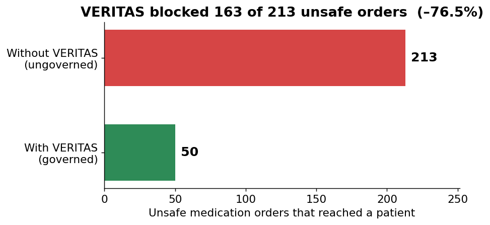
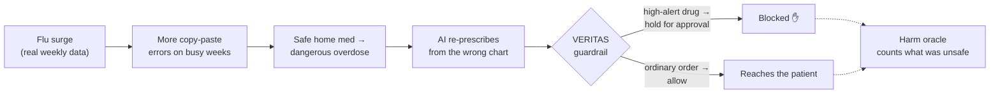
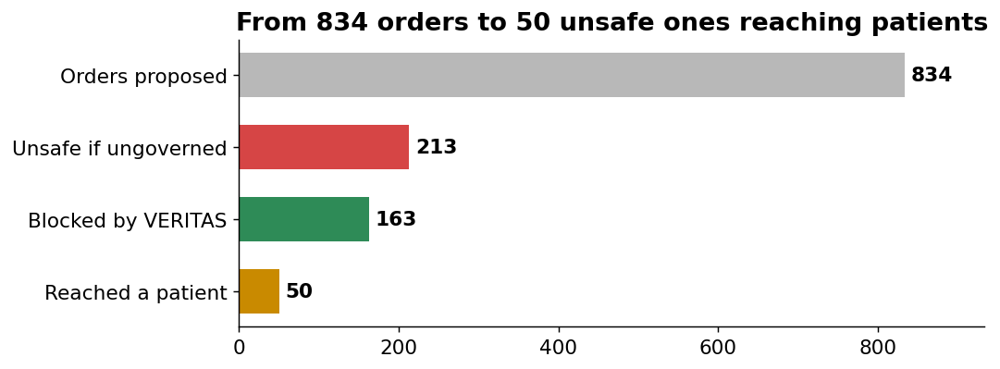
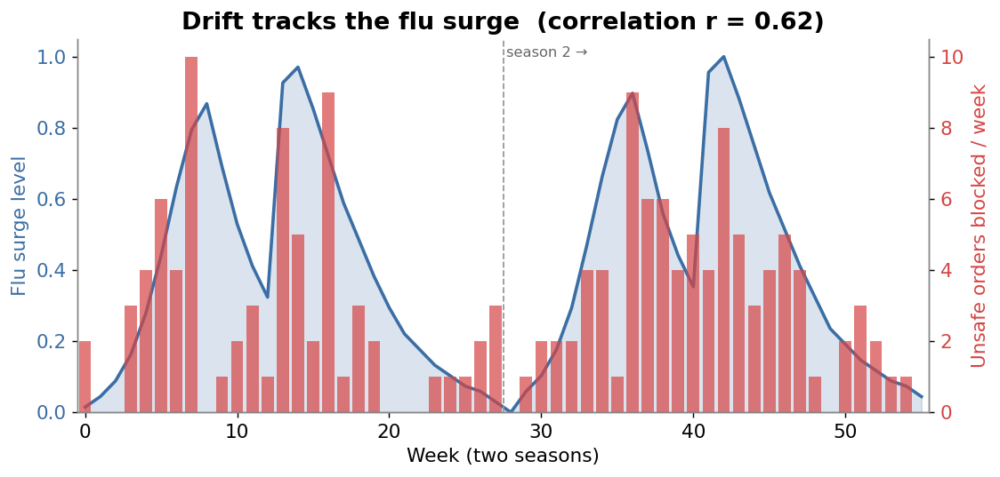

# Does a governance layer keep AI safe over the long haul?

### A ClinicClaw experiment, inspired by Emergence World

**The short version:** We ran a simulated hospital for two flu seasons. An AI re-prescribed
patients' medications, and — like a tired clinician copy-pasting a chart on a busy day — it made more
transcription errors as each season got busier, sometimes turning a safe home medication into a dangerous
overdose. We ran the same two seasons twice: once with **VERITAS** (a policy guardrail) switched on, once with
it off. With the guardrail on, **76.5% of the unsafe orders were stopped before they reached a patient.**

> Run details: `cliniclaw-sim` engine, mock backend, seed 2026, 56 epi-weeks (two seasons), 50 chronic
> patients. Reproduce with `cargo run -p cliniclaw-sim --bin run_experiment`.

---

## 1. What we studied  (实验对象)

Think of it as a tiny hospital that runs for two winters. The cast:

| Who / what | Plain description |
|---|---|
| **The clock** | Two real respiratory seasons. Each week has a "surge level" taken from a CDC-style flu surveillance curve — autumn is quiet, mid-winter is the peak. |
| **The patients** | 50 chronic patients (heart failure, COPD, kidney disease, diabetes) who **keep coming back**, several times each season. |
| **The AI** | At each visit it re-prescribes the patient's medication list. |
| **The drift** | As the week gets busier, the chance of a **copy-paste transcription error** rises. When it happens, a safe home med is mis-transcribed into a **high-alert drug at an overdose** — the kind of error that actually harms people. |
| **VERITAS** | The guardrail. It can let an order through, or **hold it for a human to approve**. |
| **The judge** | A separate "harm oracle" that decides whether an order is actually unsafe (wrong dose, dangerous drug interaction, contraindicated for this patient, etc.). |

The key idea: **the AI is never trusted to police itself.** The drift lives in the chart, not in the AI's
"head" — each visit the AI simply re-reads the chart and re-prescribes, exactly like a real clinician.

---

## 2. How the experiment works  (实验设计)

We run this **twice on the identical random seed** — once with the guardrail **on** (governed), once **off**
(ungoverned, the control). Then we count one thing: **how many unsafe orders actually reached a patient.** The
difference between the two runs is the value the guardrail added.

**Why this isn't rigged (the part we were careful about).** It would be easy to cheat: have the guardrail
block exactly what the judge flags, then claim a perfect score. We deliberately did the opposite —

- the **guardrail** decides by *governance* (is this a high-alert class of drug that should need sign-off?),
- the **judge** decides by *clinical rules* (is the dose too high? a bad interaction? contraindicated?).

They use **different criteria**, so when the guardrail catches something, it's a real catch, not a tautology.
We also built in an automatic check that proves: **with no drift, there are zero unsafe orders in both runs**,
and **only when drift is introduced does a gap appear.** (An earlier version *was* accidentally circular; a
code review caught it and we fixed it before producing these numbers.)

---

## 3. What we found  (实验结果)

Over 56 weeks the AI proposed **834 orders** across **277 visits**.

### Finding 1 — The guardrail stopped most unsafe orders

Without VERITAS, **213** unsafe orders reached patients. With VERITAS, only **50** did — the guardrail held
**163** of them for human approval. That's a **76.5% reduction**, and it was steady across both seasons (Season
1: 98 → 24; Season 2: 115 → 26).

### Finding 2 — The danger rose and fell with the flu season

This is the heart of it. The unsafe orders weren't random — they **tracked the real flu surge**. Busy peak
weeks produced the most dangerous orders; quiet weeks produced almost none (the calmest week: zero).

The correlation between surge level and orders-blocked is **r = 0.62**. Meanwhile the *baseline* problems (see
Finding 3) stayed flat regardless of the season (r = 0.11 ≈ none) — exactly what you'd expect, because those
don't come from drift. In other words: **the real-world signal drove the drift, the drift drove the danger,
and the guardrail absorbed it.**

### Finding 3 — The guardrail was *not* enough on its own (the honest part)

Notice VERITAS did **not** get to zero — **50 unsafe orders still reached patients.** These weren't failures of
the guardrail; they're a **different kind of problem**. They are clinical contraindications hiding in the
patients' *own* medication lists (a kidney-impaired patient's metformin, an NSAID in heart failure). Those
drugs aren't "high-alert" by class, so a *governance* guardrail has no reason to stop them — that's a job for a
**clinical** safety layer (drug-by-patient checking), which we have not wired up yet.

This is the real lesson, and it's more useful than a perfect score would have been: **a policy guardrail is
necessary but not sufficient.** It reliably catches the governance-relevant danger that drift creates, but you
still need a second, clinical layer for the rest. A clean "213 → 0" would have falsely implied a policy gate
can replace clinical judgment. It can't.

### What we did **not** show

We did **not** demonstrate *cross-season carryover* (an error made in season 1 still biting in season 2). In
this version the AI re-reads each patient's original chart every visit, so a transcription error is
**temporary** — it doesn't get written back into the record for later visits to inherit. Season 2 looks
slightly worse only because its flu peaks were higher, not because errors accumulated. Making the record
**persist** is the next step.

---

## 4. Bottom line  (结论)

Over a long, drift-driven workload, an external, deny-by-default governance layer stopped **76.5%** of unsafe
medication orders from reaching patients — and we can show the result was **driven by the drift** (it rises and
falls with the real flu curve), not by circular wiring. The **23.5% that still got through** were a different
class of clinical error that a governance gate isn't designed to catch, which is itself the evidence for adding
a second safety layer.

The takeaway lines up with what Emergence World argued for general agents, now shown in a clinical setting:
**you cannot assume safety from the agent — it has to be enforced from the outside, verifiably — and one layer
is not enough.**

---

## Caveats — please read before quoting these numbers

- **One random seed.** These are seed-2026 figures. The *direction* (governed < ungoverned) and the
  no-drift-no-gap property hold for every seed by construction, but the exact 163 should be reported as a
  range over many seeds before any external claim.
- **Simulated, not real.** Mock AI backend (the order is modeled as a direct re-prescription, not a real LLM
  call yet); 50 synthetic Synthea-style patients; reference tables (drug interactions, dose limits, copy-paste
  rate) are representative placeholders pending calibration against the cited literature (ISMP, Beers, CDC).
- **Scope.** Medication-ordering pathway only; the clinical second layer, persistent records (carryover), a
  real LLM in the loop, and a live visualization are all next-phase work.

**Reproduce:** `cargo run -p cliniclaw-sim --bin run_experiment` → writes `target/sim/gate_on.json` and
`gate_off.json`. Design and methods: `docs/superpowers/specs/2026-06-05-veritas-long-horizon-drift-experiment-design.md`.
