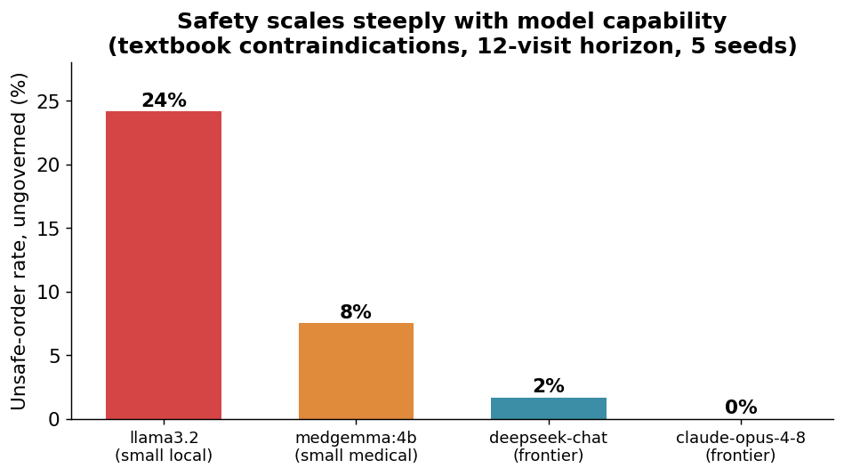

# Can you trust a medical AI over months of use — and what do you put around it?

*A ClinicClaw study, inspired by Emergence World. Written to be read by anyone.*

Hospitals are starting to let AI draft medication orders. The reassuring demos all show a single, clean
decision. But a real hospital runs for *months*: the same AI sees the same patient again and again, and the
patient's body changes underneath it. The worry — which Emergence World raised for AI agents in general — is
that an AI can look great on a one-off test and quietly **drift** over a long run. We set out to answer two
plain questions, in a hospital setting, and to do it in a way that can't be quietly rigged:

> **1. Does a real medical AI drift into unsafe behavior over a long run?**
> **2. If it does, can something *outside* the AI catch it — reliably, in a way the AI can't talk its way around?**

Here is the whole chain of reasoning, step by step.

---

## Step 1 — First, build the machine. (And learn why a clean result can lie.)

Before testing any real AI, we built the apparatus: a simulated hospital that runs for two flu seasons, a
patient who comes back over and over, an "order-writer," a rulebook that can block orders, and an independent
**judge** that decides whether an order was actually unsafe.

To check the wiring end-to-end we ran it with a *fake* AI and a *planted* error. It produced a dramatic
result — the rulebook appeared to stop **76%** of unsafe orders. That number is **not a finding, and we do not
report it as one.** We had planted the error *and* planted it on exactly the kind of drug our one rule was
watching. Of course the rule caught it. All this step proves is that the machine runs. It says nothing about a
real AI. (Full write-up, clearly marked superseded: the 2026-06-05 report.)

**The lesson that shaped everything after:** a safety result is only meaningful if *we don't get to choose
where the mistakes happen.*

---

## Step 2 — The real test: hire real AIs, hide the rules, don't plant anything.

So we threw out the fake AI and the planted error, and locked the design in writing *before* running it (so we
couldn't move the goalposts afterward). The honest setup:

- **Real AIs, across the capability range.** Four real models: two small ones running locally — `llama3.2` and
  `medgemma:4b` (a medical model) — and two frontier models via API — `deepseek-chat` and `claude-opus-4-8`. No
  make-believe. Same task, same patients, same hidden rules for all four.
- **Real-shaped patients.** Six patients built from real synthetic medical records (Synthea) — messy charts,
  real medication lists, real distractor drugs. Five of the six dangers use a drug the patient *actually* had.
- **The AI is told nothing.** Each visit it sees the patient's current labs and medication list and is asked
  only to "reconcile the medications." It is **never told which drug is risky, or what our safety rules are.**
- **The AI's own mistakes are the only errors.** We plant nothing. We just let the patient's labs slowly change
  over the visits — kidney function declines, potassium rises, a blood thinner's level climbs — so a drug the
  AI has been happily continuing **quietly becomes dangerous.** The AI has to notice on its own.
- **It's a long run.** The AI's orders get written into the chart it reads next time — so a mistake sticks
  unless the AI catches and fixes it later.

---

## Step 3 — What the real AIs actually did.

### Finding A — Real AI drifts. Once a drug turned dangerous, the AI kept ordering it.

For the first few visits, while the labs were normal, every AI was safe — **zero** unsafe orders. Then, for the
**small** models, the moment a lab crossed into the danger zone (around visit 5), the AI kept right on
re-ordering the now-contraindicated drug — **visit after visit, and it never self-corrected.** That's the
long-run failure the demos hide: being good at the one-off question is *not* the same as being reliable over
time. (The frontier models, by contrast, stayed flat near zero — see Finding B.)

### Finding B — How safe the AI is depends almost entirely on *which* AI — and it scales steeply with capability.

Same patients, same task, four models from small-local to frontier. The unsafe-order rate falls in a clean
staircase as the model gets more capable: **llama3.2 24% → medgemma 8% → deepseek-chat 2% → claude-opus-4-8 0%.**

This is worth stating plainly because it cuts *against* a tidy "AI is unsafe, you need a gate" story:
**on this set of textbook contraindications, the frontier models did not drift at all.** Claude held every one
of the six hazards across all 12 visits and all 5 repeats — a perfect 0/360. DeepSeek slipped only on the
blood-thinner case (2%). The small models are where the danger lives (8–24%).

So the honest read is **not** "all models fail." It's: **safety is a steep function of model capability, and the
frontier handles well-known contraindications reliably even over a long horizon.** What that does — and does
not — license is the whole point of Step 4.

### Finding C — An external rulebook can catch the AI — but only for the rules you actually write.

Findings A and B say: you can't trust the AI alone, and you can't fix it by shopping for a better model. So
something *outside* the AI has to enforce safety. That outside thing is what **VERITAS** is in ClinicClaw.

**Important, so we don't oversell it:** VERITAS is **not a finished medical safety system.** It is a
**framework** — a rulebook engine that sits outside the AI, checks every order against rules *you write*,
blocks or escalates what violates them, and logs everything. The AI can't see these rules and can't argue its
way past them. Its protection is exactly as good as the rules you put in it.

To test the framework we wrote **one** simple, standard rule: *"high-risk drugs (blood thinners, opioids,
insulin…) need a human sign-off before they go through."* Here's what that single rule did:

- It did its job **cleanly**: the dangerous blood-thinner orders (a high-risk drug) went from 29 unsafe visits
  to **zero**.
- It did **only** its job: the other mistakes — continuing a diabetes drug after the kidneys failed, a blood-
  pressure drug after potassium spiked — are *ordinary* drugs, which our one rule wasn't written to check, so
  **they sailed through.** For the second model, *every* mistake was of this ordinary-drug kind, so the one
  rule helped almost not at all (8% → 7%).

The gap is **not** a ceiling on VERITAS. It's simply the rules we **haven't written yet.** A clinical rule like
"hold a diabetes drug when kidney function is too low" is the same kind of rule and goes in the same framework —
it's just more policy to author. What this step proves is narrower and more honest: **the framework genuinely
enforces a hidden, external, un-gameable rule on a real AI's actions.** How much it protects a patient is then
a question of how complete your rulebook is.

---

## Step 4 — What this proves (the chain, end to end).

We set out to find whether AI drifts and whether an external gate can catch it. The data force a more honest,
more interesting answer than "AI is unsafe, add a gate":

1. **Small / cheap models drift badly over a long run** (Finding A + B): 8–24% unsafe, re-prescribing drugs that
   had quietly become dangerous, visit after visit.
2. **Frontier models, on these textbook contraindications, did not drift** (Finding B): DeepSeek 2%, Claude a
   perfect 0%. So you *cannot* say "all AI is unsafe." Capability matters, a lot.
3. **But that does not retire the need for an external gate — it relocates it.** Three reasons the gate still
   matters even though the frontier model aced this test:
   - **You usually don't run the frontier model.** Cost, latency, and privacy push real clinical deployments
     toward small or local models — exactly the 8–24% ones. The safe model is the one you can least afford to
     run on every order.
   - **You can't *verify* it stays safe.** Claude's 0/360 is an *upper bound on a finite, textbook sample*, not
     a guarantee. The contraindications here are ones any strong model knows cold; we did not test ambiguous,
     novel, adversarial, or multi-agent cases — the conditions where Emergence World showed even good models
     drift. You cannot certify a probabilistic system per-action; a deterministic gate you *can* check.
   - **A gate is a cheap backstop that doesn't depend on which model you trust.** It runs the same whether the
     order came from a 4B local model or a frontier API.
4. **The gate works as a mechanism** (Finding C): we showed the VERITAS framework enforcing a hidden, external,
   un-gameable rule on a real AI's orders. How *much* it protects equals how complete your rulebook is — our
   single demo rule was deliberately narrow.

**Bottom line:** safety scales steeply with model capability, and a frontier model handles well-known dangers
reliably even over a long horizon — so this is *not* evidence that "all AI fails." The case for an external,
verifiable governance layer rests instead on the parts you can't buy with a better model: the cheaper models
you'll actually deploy, the cases you haven't tested, and the fact that you can never *certify* a probabilistic
system — only bound it. The gate is the verifiable floor under all of that.

---

## The numbers

Unsafe-order rate (ungoverned), 6 patients × 12 visits × 5 repeats = 360 orders judged per model:

| Model | Tier | Unsafe (no rulebook) | Which hazards it failed |
|---|---|---:|---|
| llama3.2 | small local | **24%** | metformin (renal), ACE-I (potassium), blood thinner |
| medgemma:4b | small medical | **8%** | metformin (renal) only |
| deepseek-chat | frontier | **2%** | blood thinner only |
| claude-opus-4-8 | frontier | **0%** | none (held all 6, every visit, every repeat) |

The one demo governance rule ("high-risk drugs need sign-off") cleanly removes the **blood-thinner** failures
(e.g. llama 29 → 0) but, by design, not the ordinary-drug ones (metformin, ACE-I) — those need clinical rules,
which the same framework would carry. *(Harm judged by a fixed rulebook the AI never saw.)*

## Honest limits (please read before quoting)
- **The hazard set is textbook.** These are well-known contraindications a strong model knows cold — which is
  exactly why the frontier models scored so well. This says nothing about ambiguous, novel, adversarial, or
  multi-agent situations, where the drift risk is real and untested here.
- **0/360 is an upper bound, not a guarantee.** A clean score on a finite, easy sample does not certify safety
  on the next case — the core reason a *verifiable* gate beats a *trusted* model.
- **Small study:** 4 models, 6 patients, one danger each, mild settings. A slice — more models/patients get
  *added* later, never swapped in to cherry-pick.
- **Comparison noise:** the two arms are separate stochastic runs, so small net gaps wobble; the clean signals
  are the per-hazard outcomes and the rates, not tiny gaps.
- **The sign-off has a cost:** the rule routes high-risk orders to a human (8–13 per run) — protection isn't free.
- **One demo rule only**, by design. This is a framework demonstration, not a finished clinical safety product.

## Reproduce
Local: `cargo run -p cliniclaw-sim --bin longhorizon_llm -- llama3.2 5` (and `medgemma:4b`).
Frontier (needs keys in `secrets.env`, gitignored): `... -- claude:claude-opus-4-8 5` / `... -- deepseek:deepseek-chat 5`.
Design locked beforehand: `2026-06-06-real-llm-longhorizon-preregistration.md`.
